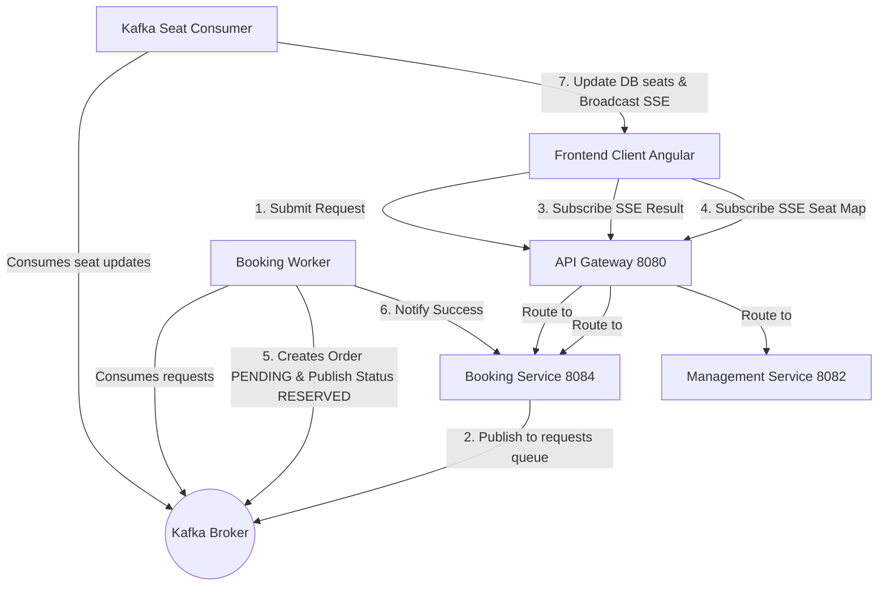
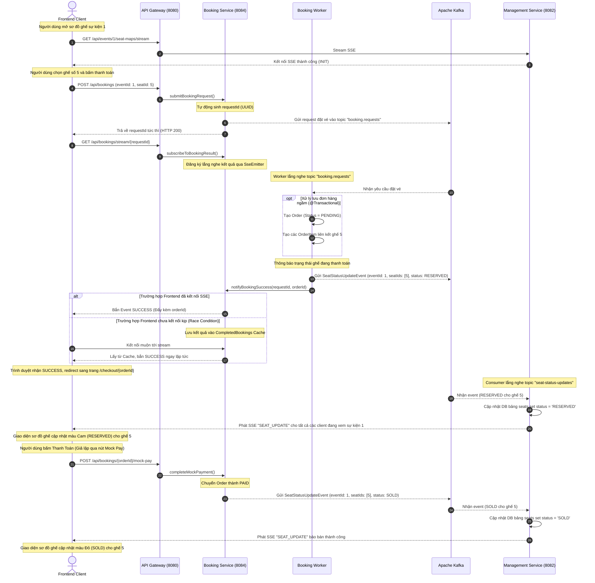

# Tài liệu Kiến trúc: Luồng Đồng bộ Trạng thái Ghế thời gian thực (Real-time Seat Status Flow)

Tài liệu này mô tả chi tiết kiến trúc và luồng dữ liệu xử lý đặt vé bất đồng bộ (Asynchronous Booking) kết hợp đồng bộ trạng thái ghế thời gian thực (Real-time Seat Status) sử dụng **Apache Kafka** và **Server-Sent Events (SSE)**.

---

## 1. Sơ đồ Kiến trúc Tổng quan (Architecture Overview)

Hệ thống bao gồm các thành phần sau phối hợp hoạt động bất đồng bộ:



---

## 2. Các Trạng thái của Ghế (Seat Status Lifecycle)

Hệ thống áp dụng chính xác các trạng thái từ [SeatStatus.java](file:///d:/thesis/BE/management/src/main/java/ict/thesis/management/entity/enums/SeatStatus.java):

1. **`AVAILABLE`**: Ghế đang trống. Bất kỳ ai cũng có thể chọn và thanh toán.
2. **`RESERVED`**: Ghế đang có người chọn và đang trong quá trình thanh toán. Trạng thái này được kích hoạt **ngay khi người dùng bấm nút "Đặt vé"** và kéo dài **cho đến khi rời khỏi trang Payment** (hoặc thanh toán thành công/thất bại).
   - Khi một ghế chuyển sang `RESERVED`, BE sẽ phát **SSE `SEAT_UPDATE`** tới tất cả các client đang mở sơ đồ ghế.
   - **FE đổi màu ghế** (ví dụ: màu Cam) để thông báo trực quan rằng ghế này đang có người chọn.
   - **Tuy nhiên, ghế `RESERVED` KHÔNG bị khoá (not locked)**. Người dùng khác vẫn có thể **click vào ghế này để cạnh tranh mua**. Hệ thống xử lý theo cơ chế **first-come-first-served** — ai thanh toán thành công trước sẽ sở hữu ghế.
   - Nếu người giữ ghế rời trang Payment mà chưa thanh toán, đơn hàng sẽ bị huỷ và ghế quay về `AVAILABLE`.
3. **`SOLD`**: Ghế đã bán thành công sau khi thanh toán hoàn tất. Ghế ở trạng thái này **không thể click được** trên giao diện.
4. **`DISABLED`**: Ghế bị ban tổ chức vô hiệu hóa.

---

## 3. Sơ đồ Tuần tự Chi tiết (Detailed Sequence Diagram)



---

## 4. Chi tiết Cấu trúc Dữ liệu Kafka (Kafka Event Payload)

* **Topic**: `seat-status-updates`
* **Key**: `eventId` (String)
* **Value**: JSON String biểu diễn `SeatStatusUpdateEvent`

**Ví dụ Payload chuyển ghế sang trạng thái RESERVED:**
```json
{
  "eventId": 1,
  "seatIds": [5, 12, 18],
  "status": "RESERVED"
}
```

**Ví dụ Payload chuyển ghế sang trạng thái SOLD (Thanh toán hoàn tất):**
```json
{
  "eventId": 1,
  "seatIds": [5, 12, 18],
  "status": "SOLD"
}
```

**Ví dụ Payload giải phóng ghế về AVAILABLE (Huỷ đơn/Thanh toán lỗi):**
```json
{
  "eventId": 1,
  "seatIds": [5, 12, 18],
  "status": "AVAILABLE"
}
```

---

## 5. Danh sách API phục vụ luồng xử lý

### 5.1. API Đặt vé (Booking Service)
- **POST `/api/bookings`**
  - **Mục đích**: Gửi yêu cầu đặt vé bất đồng bộ.
  - **Response**: `{ "requestId": "3f18fdfd-be80-4d6b-8a1b-8f59f1eb0209" }`
- **GET `/api/bookings/stream/{requestId}`** (SSE)
  - **Mục đích**: Client lắng nghe tiến độ tạo hóa đơn của `requestId`.
  - **Events**: `INIT`, `SUCCESS`, `FAILED`.

### 5.2. API Giả lập Thanh toán (Mock API)
- **POST `/api/bookings/{orderId}/mock-pay`**
  - **Mục đích**: Giả lập thanh toán thành công hóa đơn `{orderId}`. Chuyển trạng thái ghế liên quan thành `SOLD`.
- **POST `/api/bookings/{orderId}/mock-cancel`**
  - **Mục đích**: Giả lập hủy hóa đơn `{orderId}`. Giải phóng các ghế liên quan về `AVAILABLE`.

### 5.3. API Sơ đồ ghế Real-time (Management Service)
- **GET `/api/events/{eventId}/seat-maps/stream`** (SSE - Public)
  - **Mục đích**: Cho phép tất cả các client đang mở màn hình chọn ghế của sự kiện `{eventId}` đăng ký nhận thông tin cập nhật trạng thái ghế realtime.
  - **Events**: `INIT`, `SEAT_UPDATE`.
