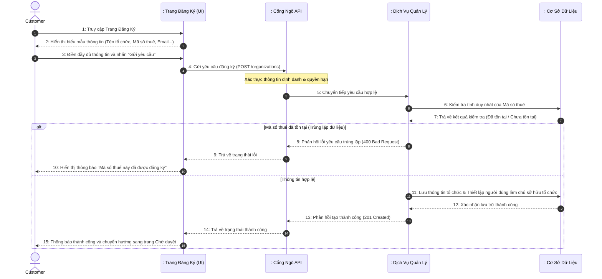
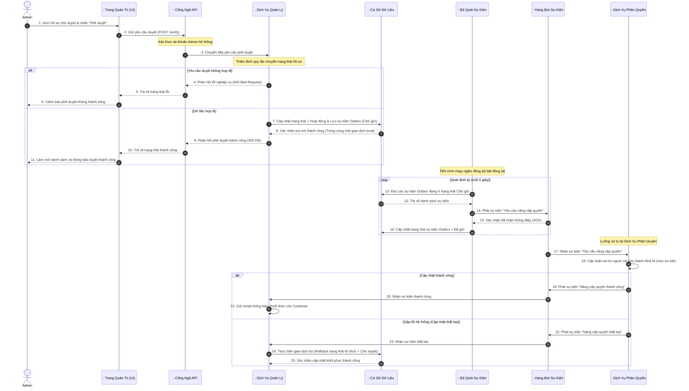

# BÁO CÁO KỸ THUẬT: PHÂN TÍCH CHI TIẾT LUỒNG ĐĂNG KÝ VÀ PHÊ DUYỆT TỔ CHỨC

Báo cáo này mô tả kiến trúc và thiết kế hệ thống theo mô hình phân lớp chuẩn (Tác nhân - Biên - Điều khiển - Thực thể) tập trung hoàn toàn vào quy trình nghiệp vụ, giải pháp kiến trúc và tương tác giữa các thành phần phần mềm.

---

## 1. Thành phần tham gia hệ thống (Actors & Lifelines)
Để mô tả luồng tuần tự đầy đủ, các đối tượng tham gia bao gồm:
1. **Actor (Tác nhân)**:
   - `Customer` (Người dùng đăng ký thông tin tổ chức để trở thành Nhà tổ chức sự kiện)
   - `Admin` (Quản trị viên hệ thống có nhiệm vụ thẩm định hồ sơ)
2. **Boundary (Lớp Biên / Cổng tiếp nhận)**:
   - `: Trang Đăng Ký (UI)` (Giao diện đăng ký dành cho người dùng)
   - `: Trang Quản Trị (UI)` (Giao diện quản lý dành cho quản trị viên)
   - `: Cổng Ngõ API (API Gateway)` (Thành phần cổng tiếp nhận yêu cầu, chịu trách nhiệm xác thực, phân quyền tập trung và chuyển tiếp yêu cầu)
3. **Control (Lớp Điều khiển / Nghiệp vụ)**:
   - `: Dịch Vụ Quản Lý` (Thành phần tiếp nhận yêu cầu, xử lý logic nghiệp vụ và quản lý trạng thái hồ sơ tổ chức)
   - `: Bộ Quét Sự Kiện` (Thành phần chạy ngầm thực hiện việc kiểm tra và chuyển tiếp thông điệp sự kiện một cách đáng tin cậy)
   - `: Hàng Đợi Sự Kiện` (Hệ thống truyền tải thông điệp và sự kiện bất đồng bộ giữa các dịch vụ)
   - `: Dịch Vụ Phân Quyền` (Thành phần quản lý thông tin tài khoản và cập nhật quyền hạn người dùng)
4. **Entity (Lớp Thực thể / Lưu trữ)**:
   - `: Cơ Sở Dữ Liệu` (Lớp lưu trữ dữ liệu thông tin tổ chức, thành viên và bảng sự kiện đợi gửi)

---

## 2. Luồng 1: Đăng ký Thông tin Tổ chức (Customer Register Organization)

Luồng này mô tả chuỗi hành động khi người dùng thực hiện tạo yêu cầu đăng ký một tổ chức/đối tác mới.

### 2.1. Sơ đồ tuần tự (Sequence Diagram - Register Flow)

### 2.2. Mô tả quy trình chi tiết
1. **Bước 1-3**: Người dùng (`Customer`) truy cập giao diện đăng ký, điền các thông tin pháp lý của tổ chức (Tên, Mã số thuế, Email liên hệ...) và nhấn nút gửi đi.
2. **Bước 4-5**: `Trang Đăng Ký` gửi dữ liệu dạng cấu trúc qua `Cổng Ngõ API`. Tại đây cổng ngõ tiến hành giải mã thông tin xác thực để kiểm tra tính danh người dùng, gắn kèm mã định danh tài khoản rồi chuyển yêu cầu đến `Dịch Vụ Quản Lý`.
3. **Bước 6-7**: `Dịch Vụ Quản Lý` truy vấn vào `Cơ Sở Dữ Liệu` để kiểm tra sự tồn tại của Mã số thuế vừa nhập nhằm ngăn chặn việc đăng ký trùng lặp.
4. **Bước 8-10 (Nhánh Trùng lặp)**: Nếu mã số thuế đã được một tổ chức khác sử dụng, dịch vụ sẽ phản hồi lỗi ngay lập tức. Cổng ngõ và UI sẽ chuyển tiếp mã lỗi và giao diện hiển thị cảnh báo trùng lặp cho người dùng.
5. **Bước 11-15 (Nhánh Thành công)**: Nếu mã số thuế hợp lệ, dịch vụ lưu bản ghi thông tin tổ chức vào cơ sở dữ liệu với trạng thái mặc định ban đầu là "Chờ duyệt", đồng thời thiết lập mối quan hệ sở hữu cho tài khoản gửi yêu cầu. Sau đó hệ thống gửi phản hồi thành công về giao diện và hiển thị thông báo chuyển đổi màn hình cho người dùng.

---

## 3. Luồng 2: Phê duyệt Tổ chức & Đồng bộ Quyền (Admin Verification & Role Sync)

Luồng này thể hiện sự phối hợp phức tạp giữa các dịch vụ trong hệ thống để thực hiện giao dịch phân tán chịu lỗi.

### 3.1. Sơ đồ tuần tự (Sequence Diagram - Verification & Event Flow)

### 3.2. Mô tả quy trình chi tiết
1. **Bước 1-3**: Quản trị viên (`Admin`) duyệt hồ sơ của tổ chức thông qua giao diện quản lý. Hệ thống kiểm tra quyền quản trị của tài khoản qua `Cổng Ngõ API` rồi gửi yêu cầu đến `Dịch Vụ Quản Lý`.
2. **Bước 4-6 (Nhánh lỗi)**: `Dịch Vụ Quản Lý` thẩm định tính hợp lệ của việc chuyển trạng thái (ví dụ hồ sơ phải chưa từng bị từ chối trước đó và có chủ sở hữu hợp lệ). Nếu vi phạm, yêu cầu bị từ chối và hiển thị cảnh báo lên UI của Admin.
3. **Bước 7-11 (Nhánh duyệt thành công)**: Nếu hợp lệ, hệ thống cập nhật trạng thái tổ chức thành "Hoạt động" (Active) và đồng thời ghi một thông điệp sự kiện "Yêu cầu nâng cấp quyền" vào bảng sự kiện chờ gửi trong cơ sở dữ liệu. Cả hai thao tác này nằm trong cùng một giao dịch cơ sở dữ liệu cục bộ nhằm đảm bảo an toàn dữ liệu. Ngay lập tức, phản hồi `200 OK` được gửi về để UI của Admin thông báo kết quả phê duyệt thành công.
4. **Bước 12-16 (Tiến trình quét sự kiện Outbox)**: Một tiến trình chạy ngầm (`Bộ Quét Sự Kiện`) tự động hoạt động định kỳ để quét các sự kiện chờ gửi trong CSDL, xuất bản (publish) sự kiện đó đến `Hàng Đợi Sự Kiện` và cập nhật lại trạng thái sự kiện thành "Đã gửi" sau khi nhận được xác nhận từ hàng đợi. Mẫu thiết kế này giúp đảm bảo sự kiện luôn được truyền đi an toàn kể cả khi hàng đợi gặp sự cố tạm thời.
5. **Bước 17-18**: `Dịch Vụ Phân Quyền` tiếp nhận sự kiện từ `Hàng Đợi Sự Kiện` và thực hiện thay đổi vai trò tài khoản của người sở hữu tổ chức thành Nhà tổ chức sự kiện (Organizer) trong phân vùng dữ liệu của mình.
6. **Bước 19-21 (Đồng bộ thành công)**: `Dịch Vụ Phân Quyền` thông báo hoàn tất qua hàng đợi. `Dịch Vụ Quản Lý` tiêu thụ sự kiện này và tự động gửi một email thông báo chúc mừng tới hòm thư của người dùng (`Customer`).
7. **Bước 22-25 (Đồng bộ thất bại - Bù giao dịch)**: Nếu dịch vụ phân quyền xảy ra sự cố đột xuất khiến không thể nâng cấp quyền hạn, nó sẽ phát sự kiện báo lỗi. `Dịch Vụ Quản Lý` khi nhận thông điệp lỗi này sẽ thực hiện **giao dịch bù** bằng cách khôi phục (rollback) trạng thái của tổ chức trong cơ sở dữ liệu về trạng thái "Chờ duyệt" ban đầu và ghi lại lý do lỗi hệ thống để bảo toàn tính toàn vẹn dữ liệu xuyên suốt các dịch vụ.

---

## 4. Các Giải Pháp Thiết Kế Kiến Trúc Nổi Bật

- **Mẫu Thiết kế Outbox (Transactional Outbox Pattern)**: Đảm bảo độ tin cậy tuyệt đối trong việc truyền tải sự kiện liên dịch vụ mà không cần giao dịch phân tán phức tạp (như cơ chế khóa hai pha gây chậm hiệu năng hệ thống).
- **Mẫu Thiết kế Saga (Event-driven Saga)**: Giải quyết sự cố trong hệ thống phân tán bằng các sự kiện giao dịch bù giúp phục hồi tự động trạng thái dữ liệu khi có một mắt xích bị gián đoạn.
- **Phản hồi phi chặn (Non-blocking response)**: Admin nhận được kết quả phê duyệt ngay lập tức khi giao dịch nội bộ hoàn tất, giúp tối ưu thời gian phản hồi giao diện.
- **Bảo mật phân lớp**: Tách biệt xác thực tập trung ở cổng ngõ API và xác thực quyền hạn dựa trên vai trò nghiệp vụ (Customer/Admin) tại các dịch vụ đích.
