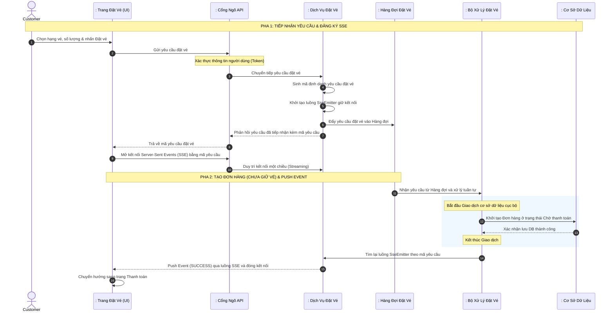
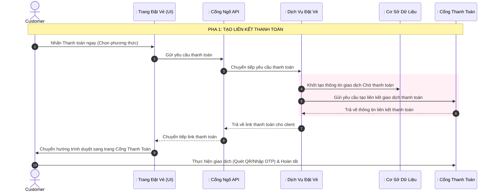
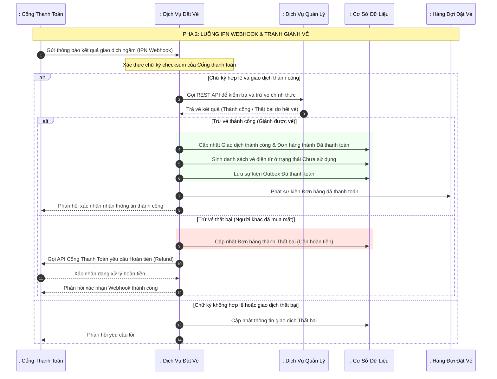
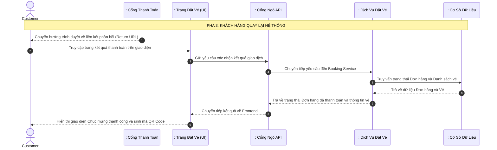
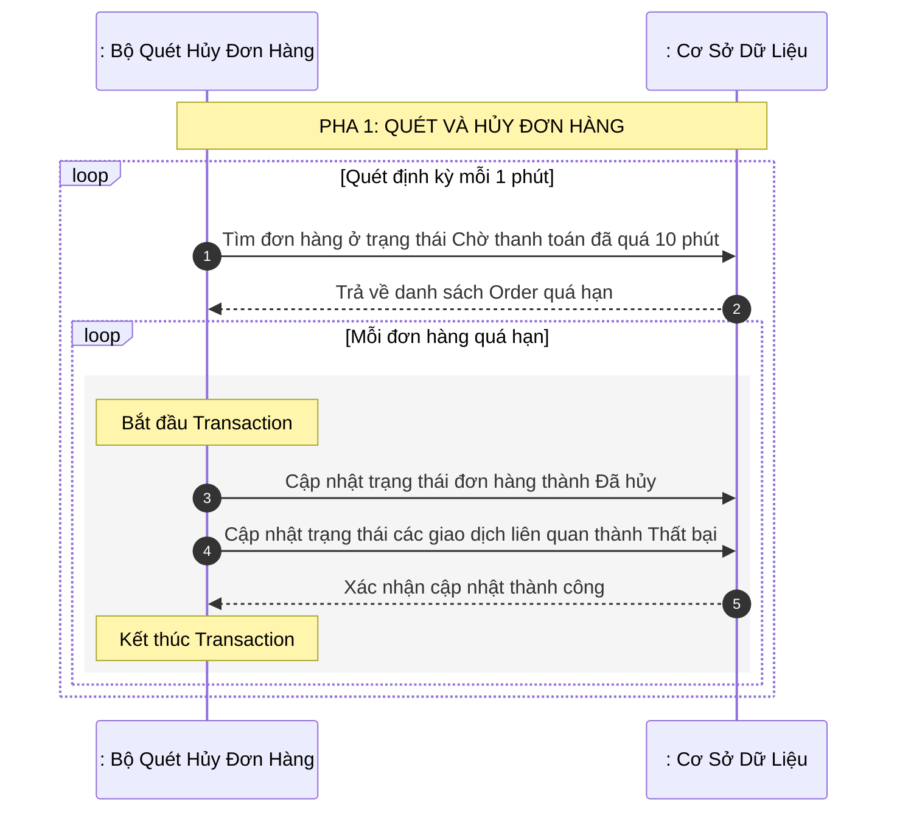

# BÁO CÁO KỸ THUẬT: PHÂN TÍCH CHI TIẾT LUỒNG ĐẶT VÉ VÀ THANH TOÁN BẤT ĐỒNG BỘ

Báo cáo này mô tả kiến trúc và thiết kế hệ thống theo mô hình phân lớp chuẩn (Tác nhân - Biên - Điều khiển - Thực thể) tập trung vào quy trình xử lý đặt vé bất đồng bộ, giải quyết tranh chấp vé bằng hàng đợi tuần tự, tích hợp cổng thanh toán bảo mật và cơ chế quét dọn đơn hàng hết hạn.

---

## 1. Thành phần tham gia hệ thống (Actors & Lifelines)

Các đối tượng tham gia trong quy trình bao gồm:
1. **Actor (Tác nhân)**:
   - `Customer` (Người dùng cuối thực hiện mua vé trên hệ thống)
2. **Boundary (Lớp Biên / Cổng tiếp nhận)**:
   - `: Trang Đặt Vé (UI)` (Giao diện người dùng thực hiện chọn vé, theo dõi trạng thái và thanh toán)
   - `: Cổng Ngõ API (API Gateway)` (Thành phần tiếp nhận yêu cầu, xác thực và định tuyến)
   - `: Cổng Thanh Toán (Momo/VNPay)` (Hệ thống thanh toán bên thứ ba cung cấp link thanh toán và gửi Webhook thông báo)
3. **Control (Lớp Điều khiển / Nghiệp vụ)**:
   - `: Dịch Vụ Đặt Vé` (Thành phần tiếp nhận yêu cầu đặt vé, sinh mã yêu cầu, quản lý trạng thái xử lý trong bộ nhớ tạm tại [BookingApplication](file:///d:/thesis/BE/booking/src/main/java/ict/thesis/booking/BookingApplication.java))
   - `: Hàng Đợi Đặt Vé` (Hạ tầng Message Broker độc lập như Kafka, đóng vai trò trung chuyển thông điệp)
   - `: Bộ Xử Lý Đặt Vé (Consumer)` (Thuộc **Dịch vụ Đặt vé**: Tiến trình chạy ngầm lắng nghe hàng đợi đặt vé theo cơ chế tuần tự để xử lý ghi nhận đơn hàng)
   - `: Bộ Quét Hủy Đơn Hàng` (Thuộc **Dịch vụ Đặt vé**: Tiến trình Scheduler chạy định kỳ để dọn dẹp các đơn hàng quá hạn thanh toán)
4. **Entity (Lớp Thực thể / Lưu trữ)**:
   - `: Bộ Nhớ Tạm (Cache)` (Lưu trữ trạng thái xử lý tạm thời của mã yêu cầu đặt vé)
   - `: Cơ Sở Dữ Liệu` (Lớp lưu trữ dữ liệu các bảng thực thể của dịch vụ đặt vé như Đơn hàng, Chi tiết đơn hàng, Giao dịch thanh toán, Vé điện tử)

---

## 2. Luồng 1: Đặt Vé Bất Đồng Bộ & Server-Sent Events (Async Booking Flow)

Luồng này mô tả cơ chế phản hồi phi chặn khi người dùng đặt vé. Thay vì bắt người dùng chờ đợi dịch vụ kiểm tra dữ liệu và ghi dữ liệu đồng bộ, hệ thống trả về ngay lập tức một mã yêu cầu và xử lý ngầm qua hàng đợi, kết quả cuối cùng được đẩy trực tiếp về trình duyệt qua kết nối SSE.

### 2.1. Sơ đồ tuần tự - Đặt vé và Trả kết quả qua SSE

### 2.2. Mô tả quy trình chi tiết
1. **Bước 1-3**: Người dùng (`Customer`) gửi yêu cầu mua vé thông qua giao diện. Yêu cầu chứa thông tin mã sự kiện, mã hạng vé, số lượng vé mong muốn. Cổng API xác thực danh tính người dùng và chuyển tiếp yêu cầu đến `Dịch Vụ Đặt Vé`.
2. **Bước 4-10 (Tiếp nhận & Đăng ký SSE)**: `Dịch Vụ Đặt Vé` khởi tạo một mã định danh yêu cầu đặt vé duy nhất và tạo ra một luồng kết nối SSE tương ứng (`SseEmitter`). Thông điệp chứa tham số yêu cầu được gửi vào hàng đợi đặt vé. Server phản hồi mã yêu cầu về cho Client. Giao diện người dùng lập tức dùng mã này mở một kết nối Server-Sent Events trực tiếp lên Server và hiển thị màn hình chờ.
3. **Bước 11-16 (Tiến trình xử lý ngầm & Push kết quả)**: Bộ xử lý lắng nghe hàng đợi theo cơ chế tuần tự. Thay vì gọi sang `Management Service` để giữ vé, hệ thống chỉ đơn giản khởi tạo một đơn hàng ở trạng thái Chờ thanh toán. Sau khi tạo xong, Consumer tìm lại luồng SSE đang mở của người dùng và đẩy một luồng tin báo thành công. Giao diện lập tức tự động chuyển sang màn hình thanh toán. (Hệ thống cho phép nhiều người cùng tạo đơn hàng và đi đến bước thanh toán cho cùng một chiếc ghế).

---

## 3. Luồng 2: Thanh Toán & Xuất Vé (Payment & Ticket Issuance Flow)

Luồng này mô tả quá trình khách hàng thực hiện trả tiền cho đơn hàng đã đặt thành công và cách hệ thống sinh mã vé điện tử bảo mật sau khi nhận được xác nhận thanh toán ngầm (IPN Webhook).

### 3.1. Sơ đồ tuần tự - Pha 1: Tạo liên kết thanh toán

### 3.2. Sơ đồ tuần tự - Pha 2: Xử lý Webhook giao dịch ngầm (Giành vé & Hoàn tiền)

### 3.3. Sơ đồ tuần tự - Pha 3: Khách hàng quay lại hệ thống

### 3.4. Mô tả quy trình chi tiết
1. **Yêu cầu thanh toán**: Khách hàng chọn phương thức thanh toán và nhấn xác nhận. Hệ thống tạo một bản ghi giao dịch ở trạng thái Chờ thanh toán trong cơ sở dữ liệu để lưu trữ dấu vết giao dịch, đồng thời gọi API của Cổng thanh toán để lấy đường dẫn liên kết thanh toán và chuyển tiếp đường dẫn này về giao diện người dùng. Trình duyệt tự động chuyển hướng khách hàng sang trang thanh toán của bên thứ ba.
2. **Xử lý Webhook ngầm (Bảo mật & Tranh giành vé)**: Đây là luồng quan trọng nhất để xác định kết quả giao dịch và xử lý nghiệp vụ tranh chấp. Khi IPN Webhook báo thanh toán thành công, hệ thống xác thực chữ ký bảo mật. Sau đó, nó ngay lập tức thực hiện gọi API sang `Dịch Vụ Quản Lý` (Management Service) để **chính thức trừ vé/giữ ghế**. Đây là điểm quyết định ai là người chiến thắng trong trường hợp nhiều người cùng thanh toán cho 1 chiếc ghế.
3. **Cập nhật trạng thái hoặc Hoàn tiền (Thuộc luồng IPN)**:
   - **Nếu giành vé thành công**: Hệ thống cập nhật trạng thái giao dịch và đơn hàng thành Đã thanh toán, sinh danh sách vé điện tử kèm mã QR bảo mật, và xuất bản sự kiện thành công lên Kafka.
   - **Nếu giành vé thất bại (ghế đã bị lấy bởi người thanh toán trước đó 1 mili-giây)**: Hệ thống cập nhật trạng thái đơn hàng thành `Thất bại (Cần hoàn tiền)` và tự động gọi API Hoàn tiền (Refund) của Cổng thanh toán (Momo/VNPay) để trả lại tiền về tài khoản cho khách hàng bị thua cuộc.
4. **Khách hàng quay lại hệ thống**: Khách hàng sau khi hoàn tất giao dịch được Cổng thanh toán chuyển hướng quay lại giao diện hệ thống thông qua liên kết phản hồi. Giao diện gọi API kiểm tra để xác nhận trạng thái thực tế của đơn hàng từ cơ sở dữ liệu và hiển thị danh sách vé điện tử kèm mã QR tương ứng (hoặc báo lỗi nếu đã bị Refund).

---

## 4. Luồng 3: Hủy Đơn Hàng Quá Hạn (TTL Order Cancellation Flow)

Để tránh tình trạng "giữ vé ảo" làm ảnh hưởng đến cơ hội mua vé của khách hàng khác và gây lãng phí tài nguyên hệ thống, tiến trình Scheduler sẽ tự động dọn dẹp các đơn hàng quá hạn thanh toán.

### 4.1. Sơ đồ tuần tự - Quét dọn đơn hàng quá hạn

### 4.2. Mô tả quy trình chi tiết
1. **Tiến trình quét định kỳ**: Bộ quét chạy ngầm hoạt động định kỳ mỗi phút một lần. Nó truy vấn vào cơ sở dữ liệu để tìm ra toàn bộ các đơn hàng vẫn ở trạng thái Chờ thanh toán nhưng có thời gian tạo vượt quá 10 phút so với thời điểm hiện tại.
2. **Cập nhật trạng thái**: Với mỗi đơn hàng quá hạn tìm thấy, hệ thống thực thi một giao dịch cục bộ để cập nhật trạng thái đơn hàng thành Đã hủy và trạng thái các yêu cầu thanh toán liên quan thành Thất bại để đóng giao dịch thanh toán. Không cần phải gửi sự kiện để cộng trả vé vì hệ thống vốn dĩ chưa từng trừ vé của người dùng lúc đặt hàng.

---

## 5. Giải Quyết Bài Toán Nhiều Người Cùng Thanh Toán Một Ghế (High Concurrency IPN & Refund)

Trong mô hình "Ai thanh toán trước được vé", bài toán **tranh chấp tài nguyên** được dời từ lúc bấm nút Đặt vé sang thời điểm **Xử lý IPN Webhook thanh toán**. Hàng chục người có thể cùng thanh toán cho 1 chiếc vé ở cùng một giây, dẫn đến nguy cơ bán quá số vé (Overbooking). 

Hệ thống giải quyết vấn đề này tại luồng IPN bằng 3 tầng bảo vệ:

### 5.1. Tầng 1: Tuần tự hóa thông qua Phân vùng của Hàng đợi sự kiện
- Khi IPN Webhook được Cổng thanh toán gọi, Booking Service không xử lý trực tiếp mà đẩy sự kiện "Đã nhận thanh toán" vào hàng đợi Kafka với khóa phân định (Partition Key) là mã ghế hoặc mã sự kiện.
- Các IPN của cùng một ghế sẽ được đưa vào cùng 1 phân vùng và được xử lý tuần tự (vào trước, ra trước) bởi Consumer. Ai có tín hiệu mạng IPN đến trước 1 mili-giây sẽ được Consumer lấy ra xử lý trước.

### 5.2. Tầng 2: Khóa phân tán cấp ứng dụng bằng a database-backed lock mechanism
- Consumer xử lý IPN sẽ dùng Khóa phân tán cấp ứng dụng bằng a central database lock registry để kiểm tra xem chiếc ghế này đã được chốt cho ai chưa.
- Consumer đầu tiên lấy được khóa sẽ gọi sang `Management Service` để trừ vé. Các Consumer của những người thanh toán chậm hơn sẽ bị chặn lại ở tầng JDBC Lock ngay lập tức và tự động nhảy vào luồng **Hoàn tiền (Refund)** mà không cần truy vấn tới DB.

### 5.3. Tầng 3: Khóa Bi Quan tầng Cơ Sở Dữ Liệu
- Tại tầng CSDL của `Management Service`, khi thực hiện hành động trừ vé chính thức, hệ thống sử dụng khóa ghi bi quan (Pessimistic Write Lock).
- Giao dịch đầu tiên sẽ khóa dòng dữ liệu của ghế/hạng vé đó lại. Các giao dịch sau nếu có lọt qua được tầng JDBC Lock cũng phải đứng chờ. Khi giao dịch đầu tiên chốt vé thành công, khóa nhả ra, các giao dịch sau đọc thấy vé đã hết sẽ bị từ chối và cũng quay về luồng Hoàn tiền.

---

## 6. Các Giải Pháp Thiết Kế Kiến Trúc Nổi Bật

- **Phản hồi Phi chặn & Thăm dò trạng thái**:
  Giúp hệ thống chịu được tải cực lớn trong thời gian mở bán vé. Luồng chính tiếp nhận yêu cầu đặt vé và trả về kết quả lập tức trong vòng vài mili-giây, toàn bộ công việc xử lý ghi CSDL nặng nề được đẩy sang hàng đợi xử lý bất đồng bộ.
- **Hàng đợi đặt vé chống quá bán**:
  Sử dụng cơ chế hàng đợi tin nhắn để tuần tự hóa các yêu cầu mua vé theo đúng thứ tự thời gian gửi. Bộ xử lý tiêu thụ lần lượt từng yêu cầu, ngăn chặn hoàn toàn hiện tượng tranh chấp dữ liệu và bán vượt quá số lượng vé thực tế có sẵn mà không cần áp dụng các cơ chế khóa dữ liệu phức tạp gây nghẽn cổ chai hệ thống.
- **Xác thực thanh toán qua Webhook độc lập**:
  Loại bỏ hoàn toàn rủi ro bảo mật từ phía Client. Mọi hoạt động cập nhật ví tiền, sinh mã vé và hoàn thành đơn hàng đều dựa trên Webhook giao tiếp trực tiếp giữa các máy chủ được xác thực bằng thuật toán mã hóa chữ ký số.
- **Cơ chế chống thanh toán lặp**:
  Sử dụng mã chống trùng lặp giao dịch khi khởi tạo yêu cầu thanh toán, ngăn ngừa việc người dùng nhấn nút thanh toán nhiều lần tạo ra các giao dịch trùng lặp trên Cổng thanh toán bên thứ ba.
- **Giải phóng tài nguyên tự động**:
  Sử dụng mô hình thời gian sống tự động hủy cho đơn hàng thông qua bộ quét chạy định kỳ giúp hệ thống tự động giải phóng lượng vé bị giữ ảo một cách nhanh chóng, tối ưu hóa cơ hội tiếp cận vé cho mọi khách hàng.

---

## 7. Các Giải Pháp Tối Ưu Hóa Hiệu Năng (Optimization)

Mặc dù kiến trúc trên đã đảm bảo tính đúng đắn và tính trọn vẹn dữ liệu, nhưng khi loại bỏ việc sao chép CSDL và dùng lệnh gọi API đồng bộ, hệ thống có nguy cơ bị "nghẽn cổ chai" (bottleneck) tại `Management Service` nếu có lưu lượng truy cập lớn (ví dụ: mở bán vé sự kiện âm nhạc nổi tiếng). 

Để hệ thống hoạt động mượt mà dưới lượng tải cao, có thể bổ sung các giải pháp tối ưu hóa sau:

### 7.1. Giao tiếp nội bộ qua gRPC thay vì REST API
Thay vì sử dụng HTTP/JSON REST API truyền thống, lệnh gọi `Trừ vé chính thức` từ Booking Service sang Management Service nên được triển khai qua **gRPC**. 
- gRPC sử dụng Protobuf (mã hóa nhị phân) và HTTP/2, giúp giảm kích thước bản tin đi đáng kể và cải thiện tốc độ giao tiếp nội bộ tới 10 lần.
- Hỗ trợ kết nối liên tục (Multiplexing) giúp tránh được chi phí khởi tạo kết nối TCP mới cho mỗi lượt khách hàng mua vé.

### 7.2. Kiểm soát đồng thời bằng Optimistic Locking (Khóa lạc quan)
Truy vấn và sử dụng khóa bi quan (Pessimistic Lock) trực tiếp trên CSDL cho mỗi lượt khách mua vé có thể làm nghẽn DB. Thay vào đó, hãy sử dụng **Optimistic Locking** (Khóa lạc quan) ở tầng Database.
- Thêm một trường theo dõi phiên bản (version tracking) vào mô hình dữ liệu hạng vé.
- Khi nhiều request cùng lúc cố gắng trừ vé, yêu cầu cập nhật sẽ tự động đối chiếu số phiên bản hiện tại. Giao dịch đầu tiên chạy thành công sẽ cập nhật số dư và tăng version lên 1.
- Các giao dịch sau sẽ thất bại do version không khớp và văng ra ngoại lệ xung đột dữ liệu đồng thời. Hệ thống bắt lỗi này và gọi luồng Hoàn tiền (Refund), giúp tránh tình trạng Deadlock và tối ưu throughput.

### 7.3. Mô hình Saga Pattern (Choreography)
Nếu không muốn phụ thuộc vào lệnh gọi đồng bộ (dù là gRPC), có thể sử dụng mô hình sự kiện (Event-driven Saga Pattern):
1. Booking Service nhận yêu cầu IPN Webhook, đổi đơn hàng thành trạng thái `PAID_PROCESSING` và phát ra sự kiện `PaymentReceivedEvent`.
2. Management Service lắng nghe sự kiện này, cố gắng trừ vé.
   - Nếu đủ vé, nó phát ra sự kiện `TicketReservedEvent`. Booking Service nghe thấy và đổi trạng thái Order thành `CONFIRMED`.
   - Nếu thiếu vé (người khác đã lấy), nó phát sự kiện `TicketReservationFailedEvent`. Booking Service nghe thấy và đổi Order thành `FAILED_REFUNDING` và gọi API Hoàn tiền.
