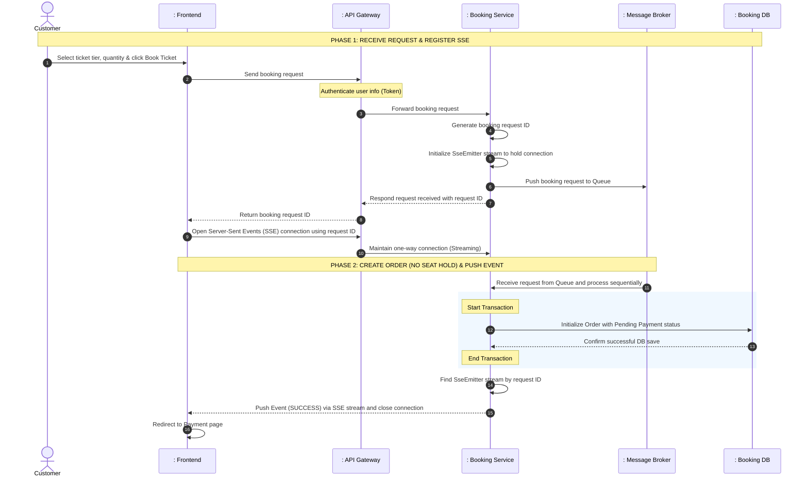
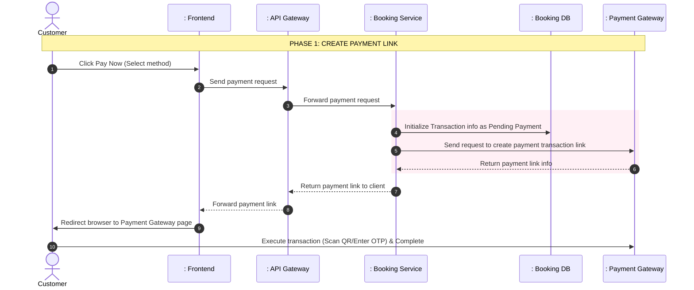
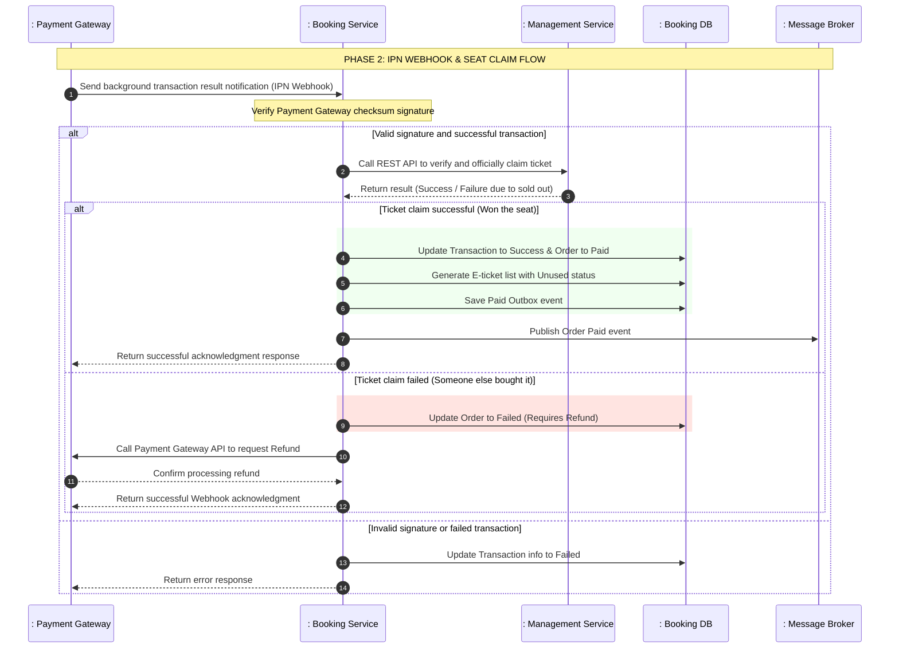
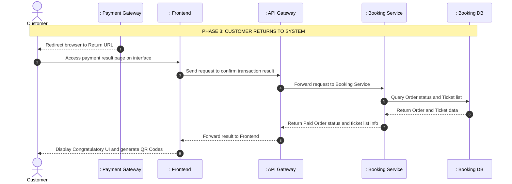
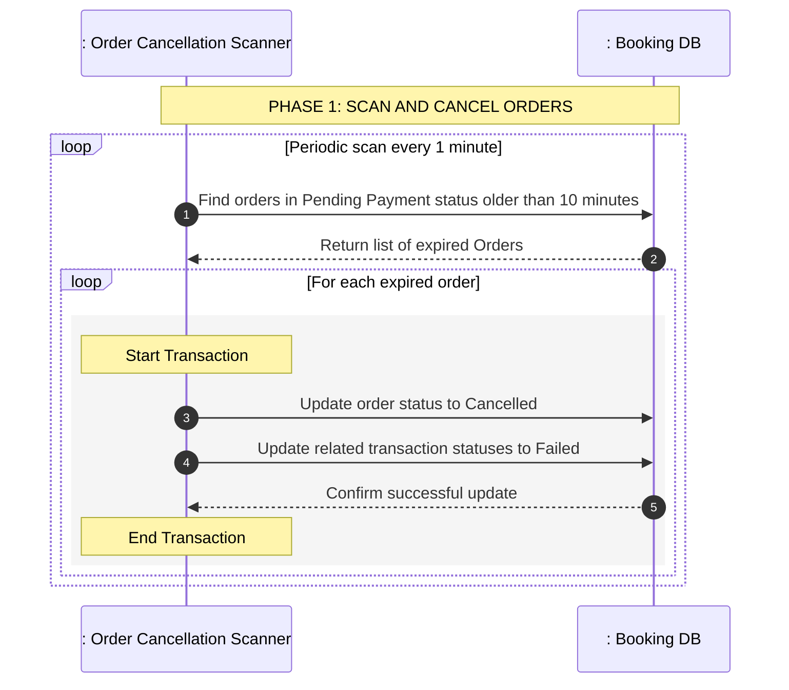

# TECHNICAL REPORT: DETAILED ANALYSIS OF ASYNCHRONOUS BOOKING AND PAYMENT FLOW

This report describes the architecture and system design according to the standard layered model (Actor - Boundary - Control - Entity), focusing on the asynchronous booking process, resolving ticket disputes via sequential queues, integrating secure payment gateways, and implementing a cleanup mechanism for expired orders.

---

## 1. System Participants (Actors & Lifelines)

The participating objects in the process include:
1. **Actor**:
   - `Customer` (End-user purchasing tickets on the system)
2. **Boundary**:
   - `: Booking Page (UI)` (User interface for selecting tickets, tracking status, and payment)
   - `: API Gateway` (Component for receiving requests, authentication, and routing)
   - `: Payment Gateway (Momo/VNPay)` (Third-party payment system providing payment links and sending Webhook notifications)
3. **Control**:
   - `: Booking Service` (Component receiving booking requests, generating request IDs, and managing processing state in temporary memory at [BookingApplication](file:///d:/thesis/BE/booking/src/main/java/ict/thesis/booking/BookingApplication.java))
   - `: Booking Broker` (Independent Message Broker infrastructure like Kafka, acting as a message relay)
   - `: Booking Processor (Consumer)` (Belongs to **Booking Service**: Background process listening to the booking queue sequentially to process and record orders)
   - `: Order Cancellation Scanner` (Belongs to **Booking Service**: Scheduler process running periodically to clean up expired payment orders)
4. **Entity**:
   - `: Temporary Memory (Cache)` (Stores temporary processing status of booking request IDs)
   - `: Database` (Data storage layer for entity tables of the booking service such as Orders, Order Details, Payment Transactions, E-tickets)

---

## 2. Flow 1: Asynchronous Booking & Server-Sent Events (Async Booking Flow)

This flow describes the non-blocking response mechanism when users book tickets. Instead of making the user wait for the service to check data and write data synchronously, the system immediately returns a request ID and processes it in the background via a queue. The final result is pushed directly to the browser via an SSE connection.

### 2.1. Sequence Diagram - Booking and Returning Results via SSE

### 2.2. Detailed Process Description
1. **User Request**: The `Customer` sends a ticket purchase request through the interface. The request contains the event ID, ticket tier ID, and desired quantity. The API Gateway authenticates the user's identity and forwards the request to the `Booking Service`.
2. **Receive & Register SSE**: The `Booking Service` generates a unique booking request ID and creates a corresponding SSE connection stream (`SseEmitter`). A message containing the request parameters is sent to the booking queue. The server responds with the request ID to the Client. The user interface immediately uses this ID to open a direct Server-Sent Events connection to the server and displays a waiting screen.
3. **Background Processing & Result Push**: The background worker inside the `Booking Service` listens to the queue sequentially. Instead of calling the `Management Service` to hold tickets, the system simply initializes an order with a Pending Payment status. After creation, the service finds the user's open SSE stream in memory and pushes a success message. The interface receives this event and automatically redirects to the payment screen. (The system uses a "No Seat Hold" strategy, allowing multiple people to simultaneously create orders and proceed to payment for the same seat).

---

## 3. Flow 2: Payment & Ticket Issuance Flow

This flow describes the process of customers paying for a successfully placed order and how the system generates a secure electronic ticket code after receiving the background payment confirmation (IPN Webhook).

### 3.1. Sequence Diagram - Phase 1: Create Payment Link

### 3.2. Sequence Diagram - Phase 2: Process Background Webhook (Claim Ticket & Refund)

### 3.3. Sequence Diagram - Phase 3: Customer Returns to System

### 3.4. Detailed Process Description
1. **Payment Request**: The customer selects a payment method and confirms. The system creates a transaction record with Pending Payment status in the database to store the transaction trace, then calls the Payment Gateway API to get the payment link URL and forwards it to the UI. The browser automatically redirects the customer to the third-party payment page.
2. **Background Webhook Processing (Security & Seat Claiming)**: This is the most crucial flow to determine the transaction result and handle contention business logic. When the IPN Webhook reports a successful payment, the system verifies the security signature. Then, it immediately makes an API call to the `Management Service` to **officially claim/deduct the ticket**. This determines the winner if multiple people pay for the same seat simultaneously.
3. **Status Update or Refund (Within IPN flow)**:
   - **If ticket claim is successful**: The system updates the transaction and order status to Paid, generates electronic tickets with secure QR codes, and publishes a success event to Kafka.
   - **If ticket claim fails (seat was taken by someone who paid 1 millisecond earlier)**: The system updates the order status to `Failed (Requires Refund)` and automatically calls the Payment Gateway's Refund API to return money to the losing customer's account.
4. **Customer Returns to System**: After completing the transaction, the customer is redirected back to the system interface via the return link. The interface calls an API to confirm the actual status of the order from the database and displays the corresponding e-tickets with QR codes (or displays an error if refunded).

---

## 4. Flow 3: TTL Order Cancellation Flow

To prevent "virtual ticket holding" from affecting other customers' purchasing opportunities and wasting system resources, a Scheduler process will automatically clean up expired payment orders.

### 4.1. Sequence Diagram - Scan and Cancel Expired Orders

### 4.2. Detailed Process Description
1. **Periodic Scanning Process**: The background scanner runs periodically once a minute. It queries the database to find all orders still in Pending Payment status but created more than 10 minutes prior to the current time.
2. **Status Update**: For each expired order found, the system executes a local transaction to update the order status to Cancelled and related payment request statuses to Failed to close the payment transaction. There is no need to send an event to refund tickets because the system never deducted the user's ticket during the booking phase.

---

## 5. Solving High Concurrency IPN & Refund for a Single Seat

In the "First-to-Pay-Wins" model, the **resource contention** problem is moved from the moment the Book button is clicked to the **Payment IPN Webhook processing** time. Dozens of people can simultaneously pay for 1 ticket in the same second, leading to the risk of Overbooking. 

The system solves this problem at the IPN flow with 3 layers of protection:

### 5.1. Tier 1: Serialization via Event Queue Partitioning
- When the IPN Webhook is called by the payment gateway, the Booking Service does not process it directly but pushes a "Payment Received" event into the Kafka queue with the Partition Key being the seat ID or event ID.
- IPNs for the same seat will be routed to the same partition and processed sequentially (first-in, first-out) by the Consumer. Whoever's IPN network signal arrives 1 millisecond earlier will be extracted and processed by the Consumer first.

### 5.2. Tier 2: Application-level Distributed Lock using a database-backed lock mechanism
- The Consumer processing the IPN will use a a central database lock registry to check if this seat has already been locked for someone.
- The first Consumer to acquire the lock will call the `Management Service` to claim the ticket. Consumers of slower payers will be immediately blocked at the JDBC Lock layer and automatically jump to the **Refund** flow without querying the DB.

### 5.3. Tier 3: Pessimistic Lock at Database Layer
- At the DB layer of the `Management Service`, when executing the official ticket claim action, the system uses a Pessimistic Write Lock.
- The first transaction will lock the data row of that seat/ticket tier. Subsequent transactions that bypass the JDBC Lock layer must also wait. Once the first transaction successfully locks the ticket, the lock is released, and subsequent transactions will see that the ticket is gone, get rejected, and also return to the Refund flow.

---

## 6. Notable Architectural Design Solutions

- **Non-blocking Response & Status Polling**:
  Helps the system withstand massive loads during ticket sales. The main thread receives booking requests and returns results instantly within milliseconds; all heavy DB write processing is pushed to the asynchronous processing queue.
- **Anti-Oversell Booking Queue**:
  Uses a message queue mechanism to serialize ticket purchase requests strictly chronologically. The processor consumes requests one by one, completely preventing data contention and overselling beyond actual capacity without applying complex database locking mechanisms that cause system bottlenecks.
- **Independent Webhook Payment Verification**:
  Completely eliminates security risks from the Client side. All activities regarding wallet updates, ticket code generation, and order completion rely on Webhooks communicating directly between servers authenticated with digital signature encryption algorithms.
- **Anti-Duplicate Payment Mechanism**:
  Uses an idempotent transaction ID when initializing payment requests, preventing users from clicking the payment button multiple times and creating duplicate transactions on the third-party Payment Gateway.
- **Automatic Resource Release**:
  Uses an automatic Time-To-Live cancellation model for orders via a periodic background scanner to help the system quickly release virtually held tickets, optimizing ticket access opportunities for all customers.

---

## 7. Performance Optimization Solutions

Although the architecture ensures correctness and data integrity, removing database replication and using synchronous API calls risks creating a bottleneck at the `Management Service` under high traffic (e.g., popular music event sales).

To keep the system running smoothly under high load, the following optimization solutions can be implemented:

### 7.1. Internal Communication via gRPC instead of REST API
Instead of traditional HTTP/JSON REST APIs, the `Official Ticket Claim` call from the Booking Service to the Management Service should be implemented via **gRPC**.
- gRPC uses Protobuf (binary encoding) and HTTP/2, significantly reducing payload size and improving internal communication speed by up to 10x.
- Supports Multiplexing to avoid the overhead of establishing new TCP connections for each customer ticket purchase.

### 7.2. Ticket Inventory Concurrency Control with Optimistic Locking
Querying and locking the Management Service DB directly with pessimistic locks for every customer ticket claim can cause bottlenecks. Instead, implement **Optimistic Locking** at the database layer.
- A version tracking field is added to the ticket data model.
- When multiple requests simultaneously attempt to deduct the ticket balance, the data access layer includes the current version identifier in the update request. The first transaction successfully updates the balance and increments the version.
- Subsequent transactions will fail with a concurrent modification error. The Booking Service catches this exception and safely creates a Refund, completely avoiding Database Deadlocks and improving throughput.

### 7.3. Saga Pattern (Choreography)
To avoid depending on synchronous calls (even gRPC), an Event-driven Saga Pattern can be used:
1. Booking Service receives IPN Webhook, changes order status to `PAID_PROCESSING`, and emits a `PaymentReceivedEvent`.
2. Management Service listens to this event, attempts to deduct the ticket.
   - If tickets are available, it emits a `TicketReservedEvent`. Booking Service listens and changes Order status to `CONFIRMED`.
   - If sold out (taken by someone else), it emits a `TicketReservationFailedEvent`. Booking Service listens, changes Order to `FAILED_REFUNDING`, and calls the Refund API.
