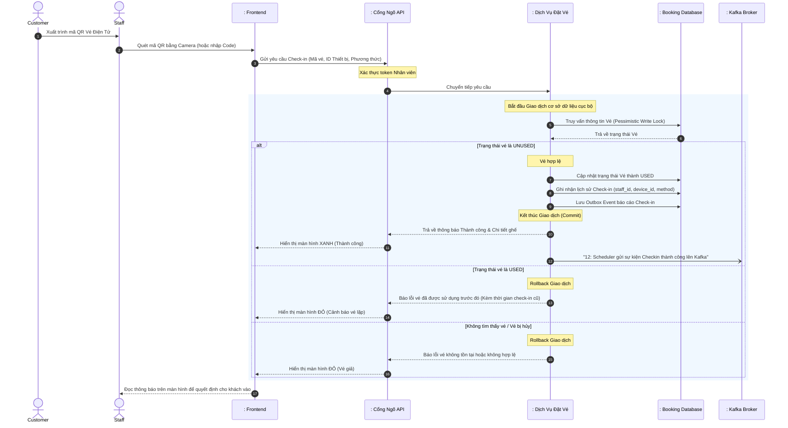

# BÁO CÁO KỸ THUẬT: PHÂN TÍCH CHI TIẾT LUỒNG SOÁT VÉ (CHECK-IN) CỦA NHÂN VIÊN

Báo cáo này mô tả kiến trúc và thiết kế hệ thống theo mô hình phân lớp chuẩn (Tác nhân - Biên - Điều khiển - Thực thể) tập trung vào quy trình nghiệp vụ soát vé điện tử tại cổng sự kiện, cơ chế ngăn chặn vé giả/vé lặp (Double-spending) và luồng đồng bộ dữ liệu thời gian thực.

---

## 1. Thành phần tham gia hệ thống (Actors & Lifelines)

Các đối tượng tham gia trong quy trình bao gồm:
1. **Actor (Tác nhân)**:
   - `Staff` (Nhân viên soát vé tại sự kiện)
   - `Customer` (Khách hàng xuất trình mã vé QR)
2. **Boundary (Lớp Biên / Cổng tiếp nhận)**:
   - `: Frontend` (Giao diện Web dùng camera quét QR hoặc nhập mã thủ công)
   - `: Cổng Ngõ API (API Gateway)` (Xác thực tài khoản nhân viên và định tuyến)
3. **Control (Lớp Điều khiển / Nghiệp vụ)**:
   - `: Dịch Vụ Đặt Vé (Booking Service)` (Chịu trách nhiệm kiểm tra tính hợp lệ của vé và ghi nhận lịch sử soát vé)
   - `: Dịch Vụ Quản Lý (Management Service)` (Quản lý phân quyền nhân viên cho sự kiện)
   - `: Event Broker (Kafka)` (Trung chuyển sự kiện để cập nhật Dashboard thống kê thời gian thực)
4. **Entity (Lớp Thực thể / Lưu trữ)**:
   - `: Cơ Sở Dữ Liệu (Booking DB)` (Chứa các bảng `tickets`, `checkins`)

---

## 2. Luồng Kiểm Soát Vé Điện Tử (E-Ticket Check-in Flow)

Luồng này mô tả chuỗi hành động khi nhân viên sử dụng thiết bị quét mã QR của khách hàng tại cổng sự kiện để xác thực quyền vào cổng.

### 2.1. Sơ đồ tuần tự - Luồng Check-in

### 2.2. Mô tả quy trình chi tiết

1. **Quét mã & Tiếp nhận**: Khách hàng đưa mã QR (hoặc mã code) cho nhân viên. Ứng dụng của nhân viên đọc dữ liệu giải mã ra `ticketCode` và gửi API lên hệ thống kèm theo thông tin ngữ cảnh (định danh thiết bị `device_id`, phương thức quét `method = QR/MANUAL`).
2. **Xác thực & Chống vé lặp (Double-spending)**: 
   - `Booking Service` tiếp nhận yêu cầu và tìm vé trong CSDL.
   - Để chặn tuyệt đối trường hợp 2 nhân viên quét cùng 1 mã QR ở 2 cổng vào cùng 1 mili-giây (do khách in nhiều bản), hệ thống sử dụng **Khóa Bi Quan (Pessimistic Write Lock)** ngay tại thời điểm truy vấn vé: `SELECT * FROM tickets WHERE ticket_code = ? FOR UPDATE`.
   - Hệ thống kiểm tra: Nếu `status == UNUSED` thì vé hợp lệ. Nếu `status == USED` (hoặc CANCELLED), lập tức từ chối để chống vé sao chép.
3. **Cập nhật & Lưu vết**:
   - Chuyển trạng thái vé sang `USED`.
   - Ghi một bản ghi mới vào bảng `checkins` chứa toàn bộ thông tin: Ai là người quét (`staff_id`), bằng thiết bị nào (`device_id`), lúc mấy giờ (`checked_in_at`), quét bằng QR hay nhập tay (`method`). Đây là căn cứ dữ liệu quan trọng nhất để hậu kiểm nếu có khiếu nại (ví dụ: truy vết xem nhân viên nào đã cố tình tuồn vé cho người quen).
4. **Đồng bộ Thống kê (Real-time Analytics)**:
   - Sử dụng lại Transactional Outbox Pattern, hệ thống lưu một sự kiện báo cáo check-in cùng transaction. 
   - Sau đó, thông báo "Có 1 khách vừa vào cổng" được bắn lên Kafka. Các dịch vụ khác (như Dashboard của Organizer) sẽ lắng nghe sự kiện này và đẩy Real-time qua Websocket/SSE về màn hình Ban tổ chức, giúp họ nhìn thấy số lượng khách trong sân cứ tăng dần lên theo từng giây một cách mượt mà, không cần phải nhấn F5 (Refresh) liên tục để gọi lệnh đếm từ DB.

---

## 3. Các Giải Pháp Thiết Kế Điển Hình Tại Lớp Check-in

- **Tính Định Danh Tuyệt Đối Thiết Bị (Device Tracking)**: 
  Lưu lại ID của thiết bị quét (`device_id`) trong bảng Checkin giúp Ban tổ chức thống kê được cổng nào đang quá tải, cổng nào đang rảnh, và truy vết gian lận nội bộ.
- **Bảo mật mã QR động (Tùy chọn)**:
  Với các sự kiện lớn, để chống việc chụp màn hình vé QR gửi cho người khác, mã QR trên ứng dụng Customer có thể được thiết kế dưới dạng TOTP (đổi mã liên tục mỗi 30 giây). Khi đó, luồng Checkin sẽ có thêm bước giải mã và kiểm tra thời hạn của token mã vạch trước khi vào luồng kiểm tra DB.
- **Offline First & Đồng bộ bất đồng bộ (Đề xuất tối ưu tương lai)**:
  Nếu sự kiện tổ chức ở nơi sóng 4G/Wifi yếu (sân vận động đông người rớt mạng), ứng dụng quét vé có thể tải trước tập dữ liệu (Whitelist Ticket Codes) xuống thiết bị. Quét vé dưới máy quét nội bộ (không cần Internet) -> Cập nhật trạng thái Offline -> Vài phút sau có mạng tự đẩy batch (gói) lịch sử check-in lên Server.
