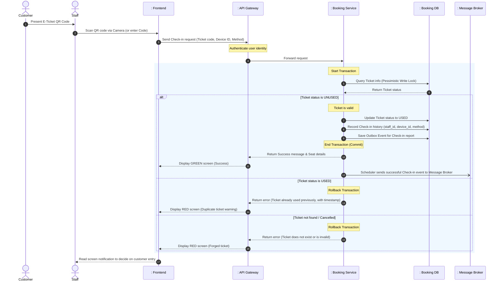

# TECHNICAL REPORT: DETAILED ANALYSIS OF E-TICKET CHECK-IN FLOW

This report describes the architecture and system design based on the standard layered model (Actor - Boundary - Control - Entity), focusing on the e-ticket check-in business process at the event gate, the mechanism to prevent forged/duplicate tickets (Double-spending), and the real-time data synchronization flow.

---

## 1. System Participants (Actors & Lifelines)

The participating objects in the process include:
1. **Actor**:
   - `Staff` (Check-in staff at the event)
   - `Customer` (Customer presenting the QR ticket code)
2. **Boundary**:
   - `: Frontend` (Web UI using camera to scan QR or manual code entry)
   - `: API Gateway` (Authenticates staff accounts and routes requests)
3. **Control**:
   - `: Booking Service` (Responsible for validating tickets and recording check-in history)
   - `: Management Service` (Manages staff permissions for the event)
   - `: Message Broker` (Kafka - Relays events to update the real-time statistics dashboard)
4. **Entity**:
   - `: Booking DB` (Contains `tickets` and `checkins` tables)

---

## 2. E-Ticket Check-in Flow

This flow describes the sequence of actions when staff uses a scanning device on the customer's QR code at the event gate to authenticate entry access.

### 2.1. Sequence Diagram - Check-in Flow

### 2.2. Detailed Process Description

1. **Scan & Receive**: The customer shows the QR code to the staff. The staff's app reads the data to get the `ticketCode`. It then sends an API request to the system with extra info (device ID, scanning method).
2. **Validation & Stop Double-Spending**: 
   - The `Booking Service` gets the request and looks for the ticket in the database.
   - To stop 2 staff members from scanning the same ticket at the exact same time (if the customer printed many copies), the system uses a **Pessimistic Write Lock** when it reads the ticket: `SELECT * FROM tickets WHERE ticket_code = ? FOR UPDATE`.
   - The system checks: If `status == UNUSED`, the ticket is good. If `status == USED` (or CANCELLED), it stops the process to prevent fake tickets.
3. **Update & History**:
   - The system changes the ticket status to `USED`.
   - It adds a new record to the `checkins` table with all details: Who scanned it (`staff_id`), with what device (`device_id`), at what time (`checked_in_at`), and how it was scanned (`method`). This is the most important proof if there are complaints later.
4. **Real-time Data Sync**:
   - Using the Transactional Outbox Pattern again, the system saves a check-in event together with the transaction. 
   - Then, a "1 customer just entered" message is sent to the Message Broker. Other services (like the Organizer's Dashboard) listen to this message and show it on the screen in real-time. This helps them see the number of people inside going up second by second, without needing to press F5 to reload the database.

---

## 3. Main Design Solutions at Check-in

- **Device Tracking**: 
  Saving the scanner's ID (`device_id`) helps Organizers see which gates are busy, which are empty, and find bad staff behavior.
- **Dynamic Secure QR Codes (Optional)**:
  For big events, to stop people from taking photos of the QR ticket and sending it to friends, the QR code on the user's app can change every 30 seconds. In this case, the Check-in flow will have one more step to check if the code is still fresh before asking the database.
- **Offline First Sync (Future Idea)**:
  If the event is in a place with bad internet, the scanning app can download the valid ticket list first. The app can scan tickets without the internet -> Update status offline -> A few minutes later when the network is back, it automatically sends the check-in data to the Server.
