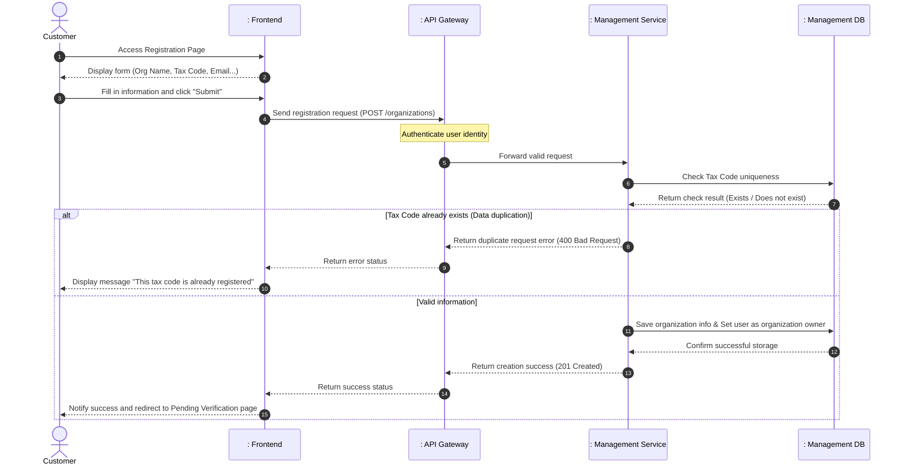
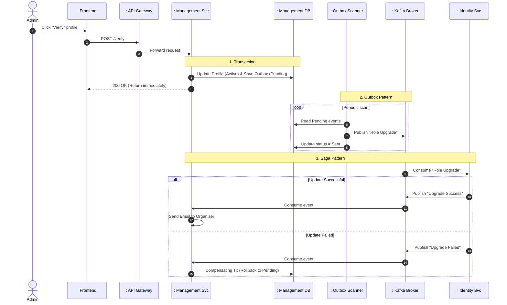

# TECHNICAL REPORT: DETAILED ANALYSIS OF ORGANIZATION REGISTRATION AND VERIFICATION FLOW

This report describes the architecture and system design according to the standard layered model (Actor - Boundary - Control - Entity), focusing entirely on the business process, architectural solutions, and interactions between software components.

---

## 1. System Participants (Actors & Lifelines)
To fully describe the sequence flow, the participating objects include:
1. **Actor**:
   - `Customer` (User registering organization information to become an Event Organizer)
   - `Admin` (System administrator responsible for verifying profiles)
2. **Boundary**:
   - `: Registration Page (UI)` (Registration interface for users)
   - `: Admin Dashboard (UI)` (Management interface for administrators)
   - `: API Gateway` (The entry point for requests, responsible for centralized authentication, authorization, and request forwarding)
3. **Control**:
   - `: Management Service` (Component receiving requests, processing business logic, and managing organization profile status)
   - `: Event Scanner` (Background process that reliably checks and forwards event messages)
   - `: Event Broker` (Asynchronous message and event transmission system between services)
   - `: Identity Service` (Component managing account information and updating user roles)
4. **Entity**:
   - `: Database` (Data storage layer for organization information, members, and pending outbox events)

---

## 2. Flow 1: Customer Register Organization

This flow describes the sequence of actions when a user submits a request to register a new organization/partner.

### 2.1. Sequence Diagram - Register Flow

### 2.2. Detailed Process Description
1. **Steps 1-3**: The `Customer` accesses the registration interface, fills in the organization's legal information (Name, Tax Code, Contact Email...) and clicks submit.
2. **Steps 4-5**: The `Registration Page` sends structured data through the `API Gateway`. Here, the gateway decodes credentials to verify user identity, attaches the account ID, and forwards the request to the `Management Service`.
3. **Steps 6-7**: The `Management Service` queries the `Database` to check the existence of the entered Tax Code to prevent duplicate registrations.
4. **Steps 8-10 (Duplicate Branch)**: If the tax code is already in use by another organization, the service immediately returns an error. The gateway and UI forward the error code, and the interface displays a duplication warning to the user.
5. **Steps 11-15 (Success Branch)**: If the tax code is valid, the service saves the organization record in the database with an initial default status of "Pending Verification", and establishes an ownership relationship for the requesting account. The system then sends a success response to the UI and displays a screen transition notification for the user.

---

## 3. Flow 2: Admin Verification & Role Sync

This flow demonstrates the complex coordination between services in the system to execute a fault-tolerant distributed transaction.

### 3.1. Sequence Diagram - Verification & Event Flow

### 3.2. Detailed Process Description
1. **Steps 1-3**: The `Admin` verifies the organization's profile through the management interface. The system checks the account's administrative privileges via the `API Gateway` and forwards the request to the `Management Service`.
2. **Steps 4-6 (Error Branch)**: The `Management Service` validates the state transition (e.g., the profile must not have been previously rejected and must have a valid owner). If violated, the request is rejected and a warning is displayed on the Admin UI.
3. **Steps 7-11 (Success Branch)**: If valid, the system updates the organization's status to "Active" and simultaneously writes a "Role Upgrade Request" event message to the pending outbox table in the database. Both operations are encapsulated within the same local database transaction to ensure data safety. An immediate `200 OK` response is sent back to the Admin UI to notify the successful verification result.
4. **Steps 12-16 (Outbox Event Scanning Process)**: A background process (`Event Scanner`) automatically runs periodically to scan pending events in the DB, publishes them to the `Event Broker`, and updates the event status to "Sent" after receiving an acknowledgment from the broker. This design pattern ensures events are always safely transmitted even if the broker experiences temporary downtime.
5. **Steps 17-18**: The `Identity Service` receives the event from the `Event Broker` and changes the account role of the organization owner to Event Organizer within its data partition.
6. **Steps 19-21 (Successful Synchronization)**: The `Identity Service` notifies completion via the broker. The `Management Service` consumes this event and automatically sends a congratulatory email to the `Customer`'s inbox.
7. **Steps 22-25 (Failed Synchronization - Compensating Transaction)**: If the identity service encounters an unexpected issue preventing the role upgrade, it publishes an error event. Upon receiving this error message, the `Management Service` executes a **compensating transaction** by rolling back the organization's status in the database to the initial "Pending Verification" state and logging the system error reason to preserve data integrity across services.

---

## 4. Notable Architectural Design Solutions

- **Transactional Outbox Pattern**: Ensures absolute reliability in cross-service event transmission without requiring complex distributed transactions (like Two-Phase Commit which degrades system performance).
- **Event-driven Saga Pattern**: Resolves failures in distributed systems using compensating transaction events that automatically restore data state when a link in the chain is disrupted.
- **Non-blocking Response**: Admins receive verification results immediately after the internal transaction completes, optimizing interface response time.
- **Layered Security**: Separates centralized authentication at the API gateway from business role-based authorization (Customer/Admin) at the destination services.
