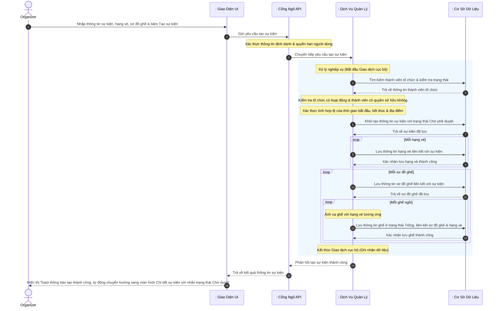
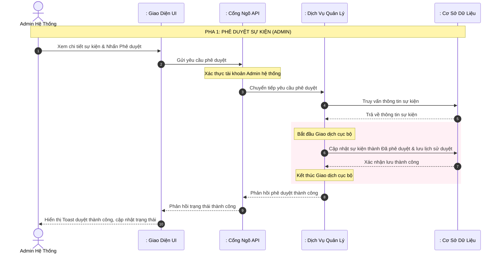
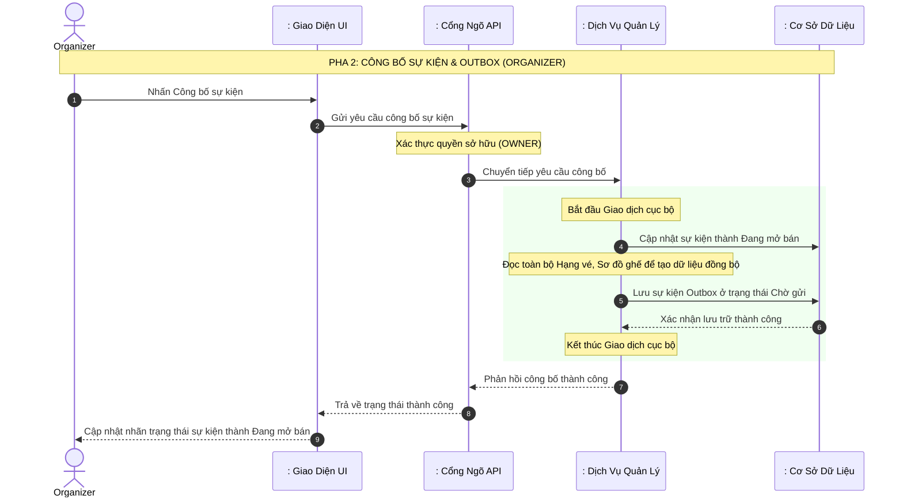

# BÁO CÁO KỸ THUẬT: PHÂN TÍCH CHI TIẾT LUỒNG TẠO VÀ CÔNG BỐ SỰ KIỆN

Báo cáo này mô tả kiến trúc và thiết kế hệ thống theo mô hình phân lớp chuẩn (Tác nhân - Biên - Điều khiển - Thực thể) tập trung hoàn toàn vào quy trình nghiệp vụ tạo sự kiện phức hợp, quy trình phê duyệt của quản trị viên và cơ chế công bố sự kiện đồng bộ bất đồng bộ qua Transactional Outbox Pattern giữa các dịch vụ.

---

## 1. Thành phần tham gia hệ thống (Actors & Lifelines)

Để mô tả luồng tuần tự đầy đủ, các đối tượng tham gia bao gồm:
1. **Actor (Tác nhân)**:
   - `Organizer` (Nhà tổ chức sự kiện - vai trò `OWNER` trong một tổ chức)
   - `Admin` (Quản trị viên hệ thống chịu trách nhiệm phê duyệt sự kiện)
2. **Boundary (Lớp Biên / Cổng tiếp nhận)**:
   - `: Giao Diện Quản Trị Tổ Chức (UI)` (Giao diện dành cho Nhà tổ chức cấu hình và quản trị sự kiện)
   - `: Giao Diện Admin Hệ Thống (UI)` (Giao diện dành cho Quản trị viên duyệt sự kiện)
   - `: Cổng Ngõ API (API Gateway)` (Xác thực thông tin định danh và phân quyền truy cập)
3. **Control (Lớp Điều khiển / Nghiệp vụ)**:
   - `: Dịch Vụ Quản Lý` (Tiếp nhận và xử lý logic nghiệp vụ tạo, duyệt và công bố sự kiện tại [EventService](file:///d:/thesis/BE/management/src/main/java/ict/thesis/management/service/EventService.java))
   - `: Bộ Quét Sự Kiện` (Tiến trình chạy ngầm quét bảng Outbox tại [OutboxPublisherScheduler](file:///d:/thesis/BE/management/src/main/java/ict/thesis/management/scheduler/OutboxPublisherScheduler.java))
   - `: Hàng Đợi Sự Kiện` (Kafka Message Broker quản lý truyền tải thông điệp)
   - `: Dịch Vụ Đặt Vé` (Booking Service nhận sự kiện để đồng bộ dữ liệu chuẩn bị bán vé)
4. **Entity (Lớp Thực thể / Lưu trữ)**:
   - `: Cơ Sở Dữ Liệu` (Lớp lưu trữ dữ liệu các bảng thực thể của `management-service` như `Events`, `TicketTier`, `SeatMap`, `Seat`, `EventApprovals`, `OutboxEvent`)

---

## 2. Luồng 1: Tạo Sự kiện (Create Event Flow)

Luồng này mô tả chuỗi hành động khi Nhà tổ chức tạo một sự kiện mới trên hệ thống.

### 2.1. Sơ đồ tuần tự (Sequence Diagram - Create Event Flow)

### 2.2. Mô tả quy trình chi tiết
1. **Bước 1-3**: Nhà tổ chức (`Organizer`) điền các thông tin sự kiện (tiêu đề, thời gian, địa điểm, banner...) kèm danh sách các hạng vé và sơ đồ ghế ngồi chi tiết. Yêu cầu được gửi qua `Cổng Ngõ API` để xác thực định danh tài khoản, sau đó được chuyển tiếp tới bộ phận xử lý tại [EventController](file:///d:/thesis/BE/management/src/main/java/ict/thesis/management/controller/EventController.java).
2. **Bước 4-5**: `Dịch Vụ Quản Lý` truy vấn thông tin thành viên của tổ chức dựa trên mã tổ chức và mã tài khoản người gửi yêu cầu. Hệ thống xác thực:
   - Tổ chức phải ở trạng thái hoạt động.
   - Người tạo phải có vai trò là chủ sở hữu tổ chức.
   - Nếu vi phạm bất kỳ điều kiện nào, hệ thống từ chối yêu cầu và trả về lỗi cấm truy cập (403 Forbidden).
3. **Kiểm tra nghiệp vụ dữ liệu**: Hệ thống kiểm tra thời gian bắt đầu của sự kiện phải ở tương lai, thời gian kết thúc phải sau thời gian bắt đầu, và địa điểm tổ chức không được để trống. Nếu không hợp lệ, trả về lỗi yêu cầu không hợp lệ (400 Bad Request).
4. **Bước 6-7**: Khởi tạo thông tin sự kiện mới với trạng thái mặc định ban đầu là Chờ phê duyệt và chưa được công bố, sau đó lưu vào cơ sở dữ liệu.
5. **Bước 8-9 (Lưu hạng vé)**: Duyệt qua danh sách các hạng vé yêu cầu. Với mỗi hạng vé, hệ thống khởi tạo thông tin hạng vé liên kết với sự kiện vừa lưu, thiết lập số lượng khả dụng ban đầu bằng tổng số lượng vé mở bán và lưu vào cơ sở dữ liệu.
6. **Bước 10-13 (Lưu sơ đồ và ghế ngồi)**: Duyệt qua từng sơ đồ ghế. Hệ thống tạo sơ đồ ghế liên kết với sự kiện và lưu vào cơ sở dữ liệu. Tiếp đó, đối với mỗi ghế ngồi thuộc sơ đồ ghế đó, hệ thống ánh xạ ghế với hạng vé tương ứng, khởi tạo ghế ở trạng thái trống, liên kết nó với sơ đồ ghế và lưu vào cơ sở dữ liệu.
7. **Bước 14-16**: Toàn bộ các thao tác ghi dữ liệu trên được bọc trong một giao dịch cơ sở dữ liệu cục bộ để đảm bảo tính toàn vẹn (tất cả cùng thành công hoặc cùng thất bại). Khi giao dịch thành công, hệ thống trả về thông tin sự kiện vừa tạo với trạng thái Chờ phê duyệt, giao diện hiển thị Toast thông báo tạo thành công và chuyển hướng người dùng.

---

## 3. Luồng 2: Phê duyệt & Công bố Sự kiện (Approve & Publish Flow)

Luồng này mô tả tiến trình phê duyệt sự kiện của Admin hệ thống và quy trình công bố sự kiện để mở bán của Nhà tổ chức thông qua cơ chế Transactional Outbox Pattern nhằm đồng bộ thông tin sang dịch vụ Đặt vé.

### 3.1. Sơ đồ tuần tự - Pha 1: Phê duyệt sự kiện

### 3.2. Sơ đồ tuần tự - Pha 2: Công bố sự kiện

### 3.3. Mô tả quy trình chi tiết
1. **Pha 1 (Phê duyệt sự kiện)**: 
   - Quản trị viên (`Admin`) gửi yêu cầu phê duyệt thông qua giao diện quản trị.
   - `Dịch Vụ Quản Lý` cập nhật trạng thái sự kiện thành Đã phê duyệt (nếu đồng ý) hoặc Đã hủy (nếu từ chối), đồng thời lưu lại thông tin quyết định và lý do vào bảng lịch sử phê duyệt. Toàn bộ quá trình được đóng gói trong một giao dịch cục bộ để đảm bảo tính toàn vẹn (ACID).
2. **Pha 2 (Công bố sự kiện)**: 
   - Nhà tổ chức (`Organizer`) thực hiện công bố sự kiện đã phê duyệt.
   - Hệ thống kiểm tra quyền hạn (chỉ chủ sở hữu của tổ chức sở hữu sự kiện mới được thực hiện) và trạng thái hiện tại của sự kiện bắt buộc phải là Đã phê duyệt.
   - Trạng thái sự kiện được đổi thành Đang mở bán. Đồng thời, hệ thống tạo một thông điệp sự kiện (Domain Event) và lưu vào bảng Outbox với trạng thái Chờ gửi. Việc ghi nhận này được thực hiện trong cùng một giao dịch cơ sở dữ liệu với thao tác cập nhật trạng thái sự kiện. Sau khi giao dịch hoàn tất (commit), phản hồi thành công lập tức trả về giao diện.
3. **Pha 3 (Phát tín hiệu mở bán - Event-Driven)**: 
   - Tiến trình chạy ngầm (Scheduler) liên tục quét bảng Outbox để đẩy các thông điệp báo hiệu "Sự kiện đã mở bán" lên Kafka Message Broker. 
   - Tín hiệu này được các dịch vụ khác (như `Dịch Vụ Đặt Vé`) tiêu thụ ngầm để thực hiện các tác vụ phi đồng bộ, điển hình là khởi tạo sẵn bộ nhớ đệm (Cache Warm-up) nhằm chuẩn bị chịu tải cao ngay khoảnh khắc sự kiện được mở bán mà không làm nghẽn luồng xử lý chính của dịch vụ quản lý.

---

## 4. Các Giải Pháp Thiết Kế Kiến Trúc Nổi Bật

- **Mẫu Thiết kế Transactional Outbox**:
  Bằng cách lưu thông điệp cần gửi vào cùng một cơ sở dữ liệu và trong cùng một giao dịch cục bộ với thao tác cập nhật trạng thái sự kiện thành Đang mở bán, hệ thống đảm bảo tính toàn vẹn dữ liệu. Sự kiện chắc chắn sẽ được lưu và tiến trình quét độc lập sẽ chịu trách nhiệm gửi lại cho đến khi thành công (đảm bảo gửi ít nhất một lần), loại bỏ hoàn toàn rủi ro mất mát dữ liệu do lỗi mạng hay sự cố của hệ thống hàng đợi tin nhắn.
- **Kiến trúc Hướng Sự kiện (Event-Driven Architecture) cho Tác vụ Phụ**:
  Việc thông báo sự kiện đã mở bán cho các hệ thống xung quanh được chuyển sang luồng bất đồng bộ thông qua hàng đợi tin nhắn. Giải pháp này giúp tách rời (decouple) luồng nghiệp vụ cốt lõi (Công bố sự kiện) khỏi các tác vụ phụ trợ (như làm nóng Cache để tối ưu truy vấn). Nhờ vậy, thời gian phản hồi (Response Time) trả về cho hệ thống cực kỳ nhanh chóng, đồng thời tăng cường khả năng chịu lỗi (Fault Tolerance) cho hệ thống tổng thể.
- **Mô hình Dữ liệu Phức hợp**:
  Sự kiện trong hệ thống bán vé là một thực thể phức tạp có cấu trúc phân cấp nhiều tầng (Sự kiện -> Sơ đồ ghế -> Ghế ngồi và Sự kiện -> Hạng vé). Thiết kế lưu trữ liên kết khóa chặt chẽ và cơ chế đóng gói dữ liệu trong Outbox giúp hệ thống truyền tải toàn bộ trạng thái cấu trúc này một cách nguyên vẹn mà không cần thực hiện nhiều truy vấn nhỏ lẻ.
- **Bảo mật phân quyền theo cấp độ Tổ chức**:
  Tích hợp cơ chế kiểm tra tư cách thành viên và quyền hạn nghiệp vụ trực tiếp trong dịch vụ, ngăn chặn các hành vi giả mạo yêu cầu từ phía Client hoặc các tài khoản không có thẩm quyền.
