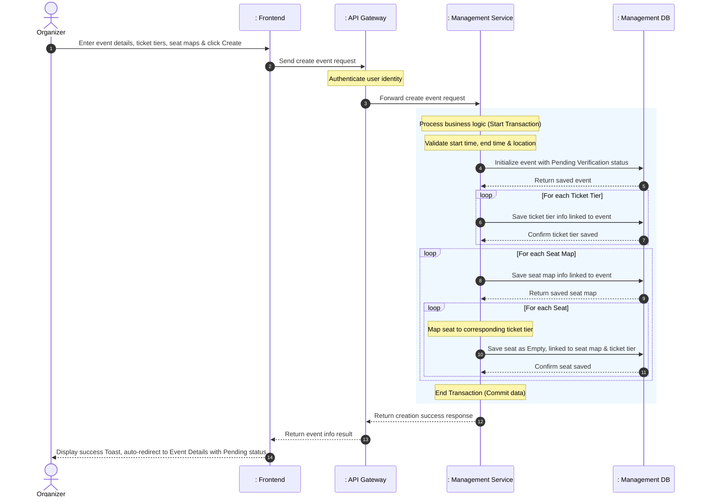
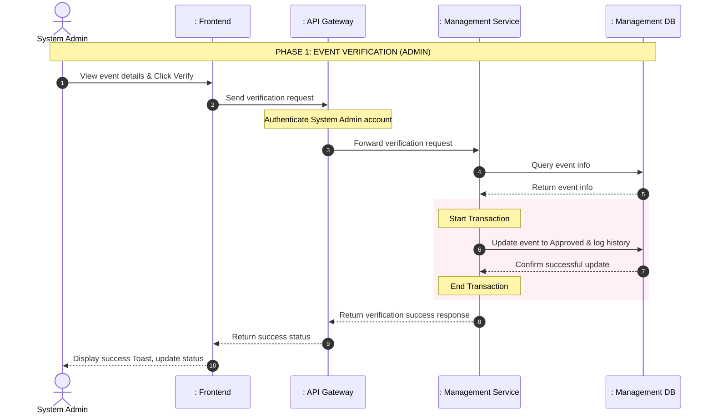
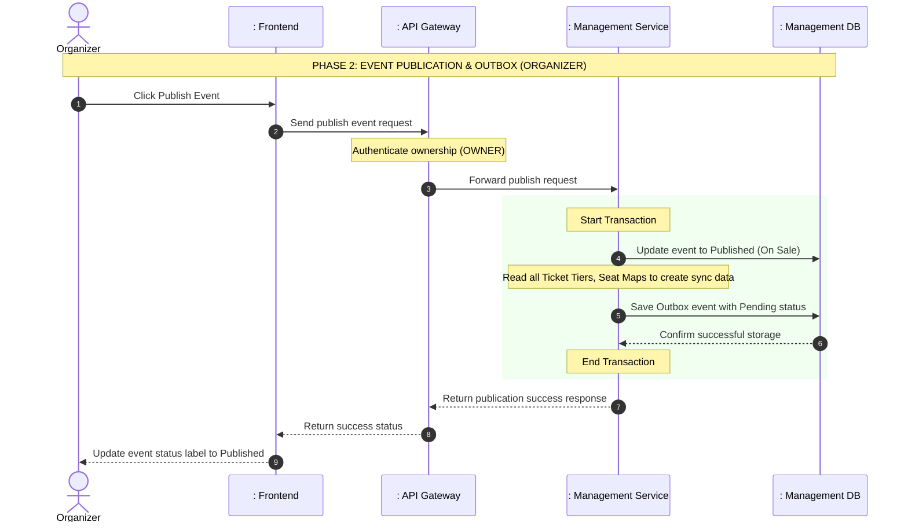

# TECHNICAL REPORT: DETAILED ANALYSIS OF EVENT CREATION AND PUBLICATION FLOW

This report describes the architecture and system design according to the standard layered model (Actor - Boundary - Control - Entity), focusing entirely on the complex event creation business process, the administrator verification process, and the asynchronous event publication mechanism via the Transactional Outbox Pattern between services.

---

## 1. System Participants (Actors & Lifelines)

To fully describe the sequence flow, the participating objects include:
1. **Actor**:
   - `Organizer` (Event Organizer - `OWNER` role in an organization)
   - `Admin` (System Administrator responsible for verifying events)
2. **Boundary**:
   - `: Organization Dashboard (UI)` (Interface for Organizers to configure and manage events)
   - `: Admin Dashboard (UI)` (Interface for Administrators to verify events)
   - `: API Gateway` (Authenticates identity and authorizes access)
3. **Control**:
   - `: Management Service` (Receives and processes business logic for event creation, verification, and publication at [EventService](file:///d:/thesis/BE/management/src/main/java/ict/thesis/management/service/EventService.java))
   - `: Event Scanner` (Background process that scans the Outbox table at [OutboxPublisherScheduler](file:///d:/thesis/BE/management/src/main/java/ict/thesis/management/scheduler/OutboxPublisherScheduler.java))
   - `: Event Broker` (Kafka Message Broker managing message transmission)
   - `: Booking Service` (Receives events to synchronize data in preparation for ticket sales)
4. **Entity**:
   - `: Database` (Data storage layer for entity tables of `management-service` such as `Events`, `TicketTier`, `SeatMap`, `Seat`, `EventApprovals`, `OutboxEvent`)

---

## 2. Flow 1: Create Event Flow

This flow describes the sequence of actions when an Organizer creates a new event on the system.

### 2.1. Sequence Diagram - Create Event Flow

### 2.2. Detailed Process Description
1. **User Input**: The `Organizer` fills in event details (title, time, location, banner...) along with a list of ticket tiers and detailed seat maps. The request is sent through the `API Gateway` for account authentication, then forwarded to the handler at [EventController](file:///d:/thesis/BE/management/src/main/java/ict/thesis/management/controller/EventController.java).
2. **Business Data Validation**: The system verifies that the event start time is in the future, the end time is after the start time, and the location is not empty. If invalid, it returns a 400 Bad Request error.
3. **Save Event Details**: Initializes a new event record with the default status of Pending Verification and unpublished, then saves it to the database.
4. **Save Ticket Tiers**: Iterates through the requested ticket tiers. For each tier, the system initializes tier info linked to the saved event, sets the initial available quantity to the total tickets for sale, and saves it to the database.
5. **Save Seat Maps and Seats**: Iterates through each seat map. The system creates a seat map linked to the event and saves it to the database. Then, for each seat in that map, the system maps the seat to its corresponding ticket tier, initializes the seat as empty, links it to the seat map, and saves it to the database.
6. **Transaction Completion**: All the above data write operations are wrapped in a local database transaction to ensure integrity (all succeed or all fail). Upon successful commit, the system returns the newly created event info with Pending Verification status, the UI displays a success Toast, and redirects the user.

---

## 3. Flow 2: Approve & Publish Flow

This flow describes the event verification process by the System Admin and the event publication process by the Organizer using the Transactional Outbox Pattern to synchronize data to the Booking Service.

### 3.1. Sequence Diagram - Phase 1: Event Verification

### 3.2. Sequence Diagram - Phase 2: Event Publication

### 3.3. Detailed Process Description
1. **Phase 1 (Event Verification)**: 
   - The Administrator (`Admin`) sends a request to check the event through the admin dashboard.
   - The `Management Service` changes the event status to Approved (if accepted) or Cancelled (if rejected). It also saves the decision and reason into the history table. The whole process is inside a transaction to make sure data is safe.
2. **Phase 2 (Event Publication)**: 
   - The `Organizer` publishes the approved event.
   - The system checks if the user is the owner and if the event status is Approved.
   - The event status changes to Published. At the same time, the system creates a message and saves it to the Outbox table with a Pending status. This happens in the same database transaction as the status update. After the transaction is done, the system sends a success message to the UI.
3. **Phase 3 (Publication Signal)**: 
   - A background process (Scheduler) keeps checking the Outbox table to send "Event Published" messages to the Kafka Message Broker.
   - Other services (like `Booking Service`) get this message to run background jobs. For example, they can prepare data in the Cache so the system runs fast when tickets go on sale. This does not block the main process.

---

## 4. Main Design Choices

- **Transactional Outbox Pattern**:
  By saving the message in the same database and transaction as the event update, the system keeps data very safe. The message will not be lost. A separate process will try to send the message again and again until it succeeds. This stops data loss if the network or Kafka has errors.
- **Event-Driven Architecture**:
  Telling other systems about the event is done in the background using message queues. This separates the main job (Publish Event) from extra jobs (like preparing Cache). Because of this, the system replies to the user very fast. It also makes the system stronger when errors happen.
- **Complex Data Model**:
  An event has many parts (Event -> Seat Map -> Seat and Event -> Ticket Tier). The Outbox method allows the system to send all these parts together without doing many small database queries.
- **Role-Based Access Control**:
  The service checks the user's role directly. This stops bad users or accounts without rights from doing things they are not allowed to do.
