## 4.4 Core Usecase Implementations

This section details the implementation of the core business flows of the system, including organization registration, event management, booking, and check-in processes.

### 4.4.1 Organization Registration and Verification

This subsection details the implementation of the core business flows related to Organizer onboarding. It demonstrates how the system handles user registration, administrative verification, and complex distributed transactions across multiple microservices.

#### 4.4.1.1 Organization Registration

This flow describes the sequence of actions when a user submits a request to register a new organization/partner on the platform.

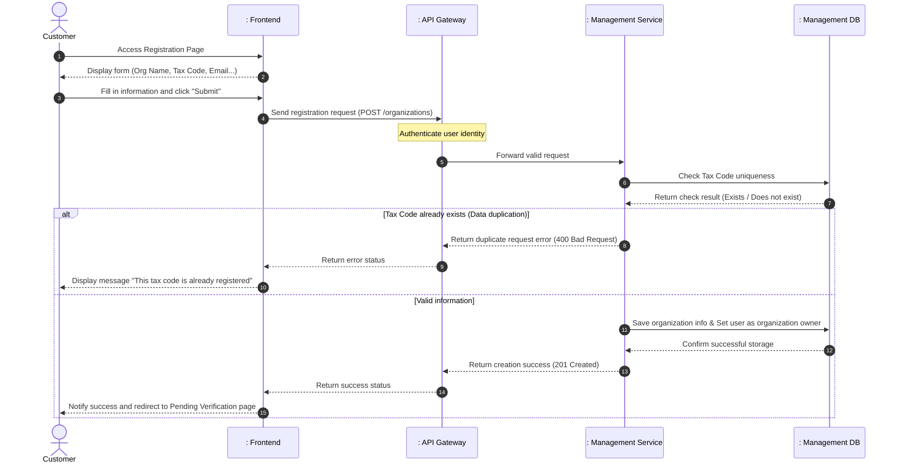

<b>Table 4.4: Organization Registration sequence diagram</b>

1. **Steps 1-3 (User Input):** The Customer accesses the registration interface, fills in the organization's legal information (Name, Tax Code, Contact Email, etc.), and submits the form.
2. **Steps 4-5 (Gateway Routing):** The Frontend sends the structured data to the API Gateway. The Gateway decodes the JWT to verify the user's identity, attaches the account ID, and forwards the request to the Management Service.
3. **Steps 6-7 (Validation):** The Management Service queries the Management Database to check the existence of the entered Tax Code to prevent duplicate organizations.
4. **Steps 8-10 (Error Branch):** If the tax code is already in use, the service immediately returns an HTTP 400 error. The UI catches this and displays a duplication warning to the user.
5. **Steps 11-15 (Success Branch):** If the tax code is unique, the service saves the new organization record with an initial status of "Pending Verification". The system establishes an ownership relationship for the user and returns a 201 Created response. The UI then redirects the user to a waiting page.

#### 4.4.1.2 Admin Verification & Role Synchronization

This flow demonstrates the complex coordination between services to execute a fault-tolerant distributed transaction when an Admin approves a pending profile.

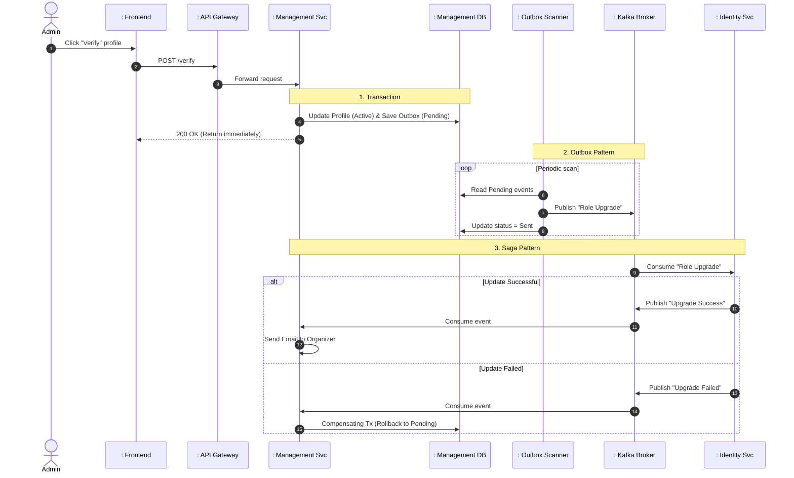

<b>Table 4.5: Admin Verification & Role Synchronization sequence diagram</b>

1. **Steps 1-3 (Request Initiation):** The Admin clicks to verify an organization's profile on the dashboard. The request is routed through the API Gateway (which authenticates the Admin role) and hits the Management Service.
2. **Steps 4-5 (Transaction):** The Management Service updates the organization's status to "Active". Simultaneously, it writes a "Role Upgrade Request" event message to the `outbox_events` table. **Both operations are encapsulated within the same local database transaction.** A 200 OK response is immediately sent back to the Admin UI, ensuring a fast, non-blocking user experience.
3. **Steps 6-8 (Transactional Outbox Pattern):** A background process (`Outbox Scanner`) automatically runs periodically to scan pending events in the Database. It reads the new event, safely publishes it to the Kafka Broker, and updates the local status to "Sent". This guarantees at-least-once message delivery even if Kafka is temporarily down.
4. **Step 9 (Message Consumption):** The Identity Service consumes the "Role Upgrade Request" event from Kafka to change the account role of the organization owner to `Organizer` within its own database.
5. **Steps 10-12 (Saga Pattern - Success Branch):** If the Identity Service updates the role successfully, it publishes an "Upgrade Success" event. The Management Service consumes this and automatically sends a congratulatory email to the user.
6. **Steps 13-15 (Saga Pattern - Compensating Transaction):** If the Identity Service encounters an unexpected error (e.g., database constraint violation), it publishes an "Upgrade Failed" event. Upon receiving this, the Management Service executes a **Compensating Transaction** by rolling back the organization's status in the database to "Pending Verification", preserving system-wide data integrity.

#### 3. Notable Architectural Design Solutions

*   **Transactional Outbox Pattern:** Ensures absolute reliability in cross-service event transmission (solving the dual-write problem) without requiring complex distributed transactions like Two-Phase Commit (2PC).
*   **Event-driven Saga Pattern:** Resolves failures in distributed systems using compensating transaction events that automatically restore the data state when a downstream service fails.
*   **Non-blocking UI Response:** Admins receive verification results immediately after the Transaction completes (Step 5), drastically optimizing the interface response time instead of waiting for the entire distributed flow to finish.

### 4.4.2 Event Management (Creation & Publication)

#### 4.4.2.1 Create Event Flow

This flow describes the sequence of actions when an Organizer creates a new event on the system.

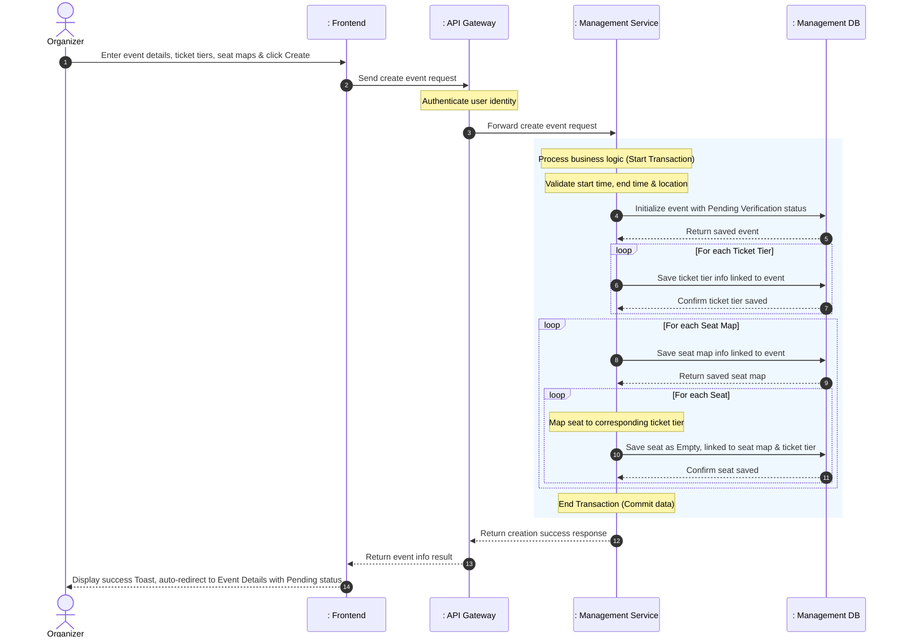

<b>Table 4.6: Create Event Flow sequence diagram</b>

1. **User Input**: The `Organizer` fills in event details (title, time, location, banner...) along with a list of ticket tiers and detailed seat maps. The request is sent through the `API Gateway` for account authentication, then forwarded to the handler at [EventController](file:///d:/thesis/BE/management/src/main/java/ict/thesis/management/controller/EventController.java).
2. **Business Data Validation**: The system verifies that the event start time is in the future, the end time is after the start time, and the location is not empty. If invalid, it returns a 400 Bad Request error.
3. **Save Event Details**: Initializes a new event record with the default status of Pending Verification and unpublished, then saves it to the database.
4. **Save Ticket Tiers**: Iterates through the requested ticket tiers. For each tier, the system initializes tier info linked to the saved event, sets the initial available quantity to the total tickets for sale, and saves it to the database.
5. **Save Seat Maps and Seats**: Iterates through each seat map. The system creates a seat map linked to the event and saves it to the database. Then, for each seat in that map, the system maps the seat to its corresponding ticket tier, initializes the seat as empty, links it to the seat map, and saves it to the database.
6. **Transaction Completion**: All the above data write operations are wrapped in a local database transaction to ensure integrity (all succeed or all fail). Upon successful commit, the system returns the newly created event info with Pending Verification status, the UI displays a success Toast, and redirects the user.

---

#### 4.4.2.2 Approve & Publish Flow

This flow describes the event verification process by the System Admin and the event publication process by the Organizer using the Transactional Outbox Pattern to synchronize data to the Booking Service.

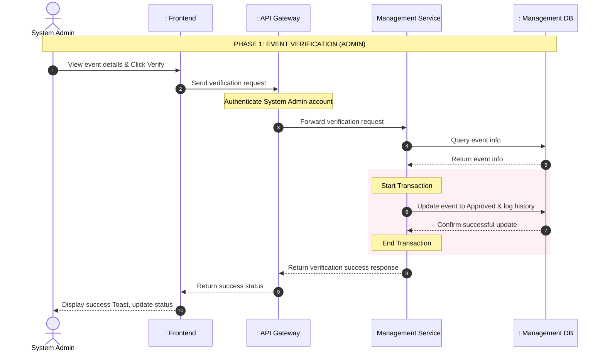

<b>Table 4.7: Approve & Publish Flow - Phase 1: Event Verification sequence diagram</b>

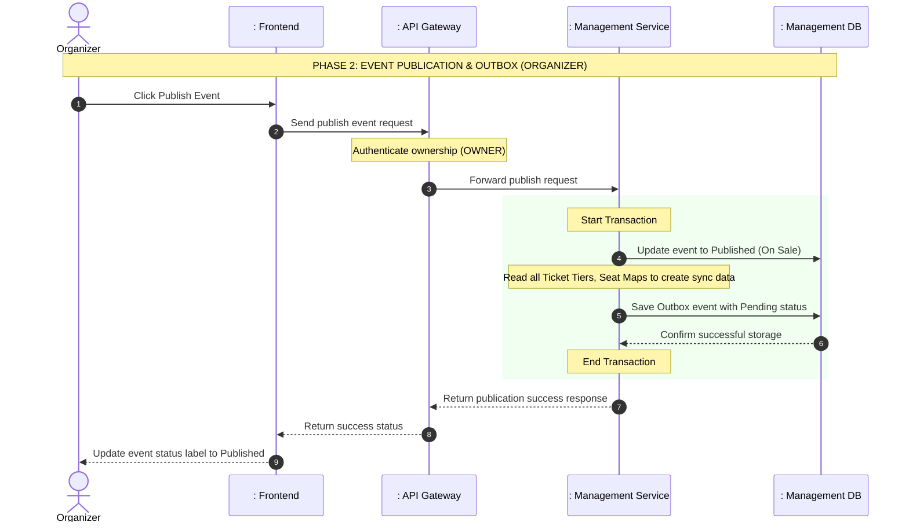

<b>Table 4.8: Approve & Publish Flow - Phase 2: Event Publication sequence diagram</b>

1. **Phase 1 (Event Verification)**: 
   - The Administrator (`Admin`) sends a request to check the event through the admin dashboard.
   - The `Management Service` changes the event status to Approved (if accepted) or Cancelled (if rejected). It also saves the decision and reason into the history table. The whole process is inside a transaction to make sure data is safe.
2. **Phase 2 (Event Publication)**: 
   - The `Organizer` publishes the approved event.
   - The system checks if the user is the owner and if the event status is Approved.
   - The event status changes to Published. At the same time, the system creates a message and saves it to the Outbox table with a Pending status. This happens in the same database transaction as the status update. After the transaction is done, the system sends a success message to the UI.
3. **Phase 3 (Publication Signal)**: 
   - A background process (Scheduler) keeps checking the Outbox table to send "Event Published" messages to the Kafka Message Broker.
   - Other services (like `Booking Service`) get this message to run background jobs. For example, they can prepare data in the Cache so the system runs fast when tickets go on sale. This does not block the main process.

---

#### 3. Notable Architectural Design Solutions

*   **Transactional Outbox Pattern**:
  By saving the message in the same database and transaction as the event update, the system keeps data very safe. The message will not be lost. A separate process will try to send the message again and again until it succeeds. This stops data loss if the network or Kafka has errors.
*   **Event-Driven Architecture**:
  Telling other systems about the event is done in the background using message queues. This separates the main job (Publish Event) from extra jobs (like preparing Cache). Because of this, the system replies to the user very fast. It also makes the system stronger when errors happen.
*   **Complex Data Model**:
  An event has many parts (Event -> Seat Map -> Seat and Event -> Ticket Tier). The Outbox method allows the system to send all these parts together without doing many small database queries.
*   **Role-Based Access Control**:
  The service checks the user's role directly. This stops bad users or accounts without rights from doing things they are not allowed to do.

### 4.4.3 Ticket Booking & Payment

#### 4.4.3.1 Asynchronous Booking & Server-Sent Events (Async Booking Flow)

This flow describes the non-blocking response mechanism when users book tickets. Instead of making the user wait for the service to check data and write data synchronously, the system immediately returns a request ID and processes it in the background via a queue. The final result is pushed directly to the browser via an SSE connection.

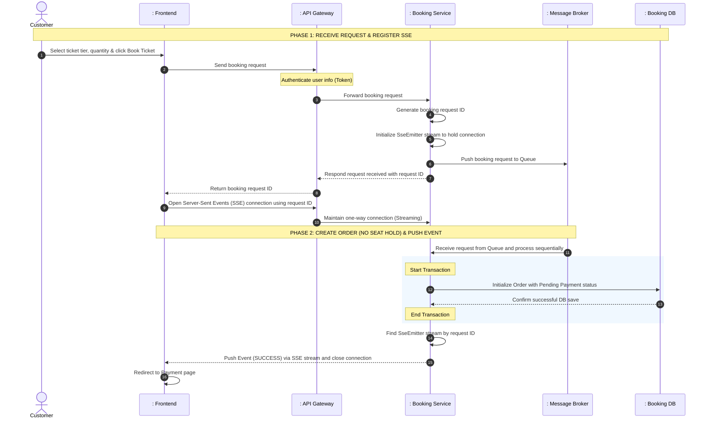

<b>Table 4.9: Asynchronous Booking & Server-Sent Events (Async Booking Flow) sequence diagram</b>

1. **User Request**: The `Customer` sends a ticket purchase request through the interface. The request contains the event ID, ticket tier ID, and desired quantity. The API Gateway authenticates the user's identity and forwards the request to the `Booking Service`.
2. **Receive & Register SSE**: The `Booking Service` generates a unique booking request ID and creates a corresponding SSE connection stream (`SseEmitter`). A message containing the request parameters is sent to the booking queue. The server responds with the request ID to the Client. The user interface immediately uses this ID to open a direct Server-Sent Events connection to the server and displays a waiting screen.
3. **Background Processing & Result Push**: The background worker inside the `Booking Service` listens to the queue sequentially. Instead of calling the `Management Service` to hold tickets, the system simply initializes an order with a Pending Payment status. After creation, the service finds the user's open SSE stream in memory and pushes a success message. The interface receives this event and automatically redirects to the payment screen. (The system uses a "No Seat Hold" strategy, allowing multiple people to simultaneously create orders and proceed to payment for the same seat).

---

#### 4.4.3.2 Payment & Ticket Issuance Flow

This flow describes the process of customers paying for a successfully placed order and how the system generates a secure electronic ticket code after receiving the background payment confirmation (IPN Webhook).

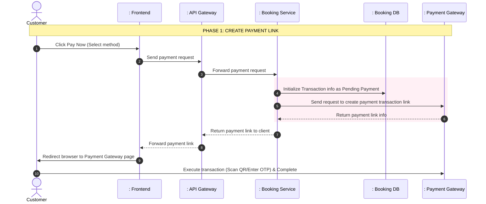

<b>Table 4.10: Payment & Ticket Issuance Flow - Phase 1: Create Payment Link sequence diagram</b>

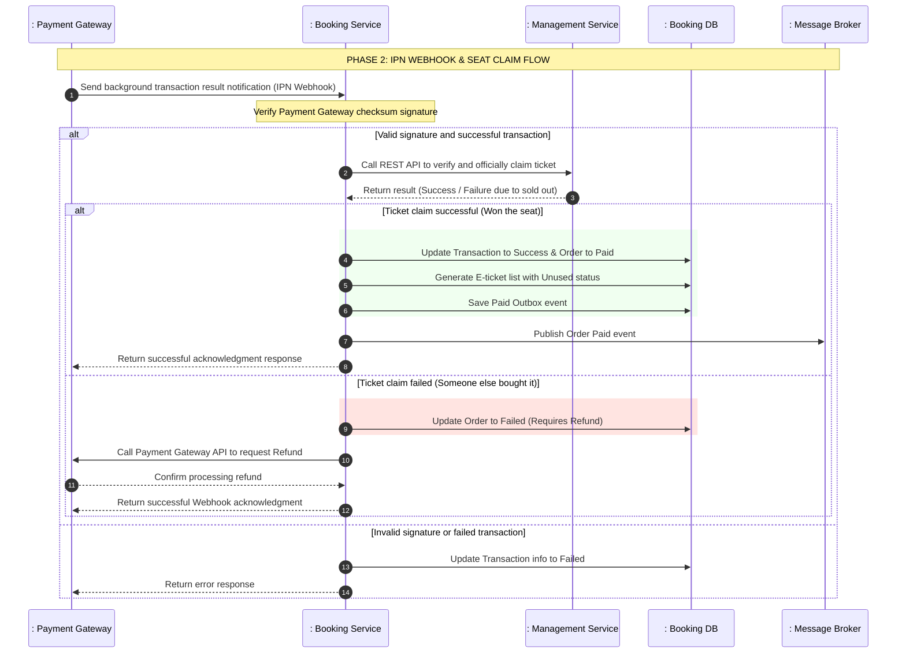

<b>Table 4.11: Payment & Ticket Issuance Flow - Phase 2: Process Background Webhook sequence diagram</b>

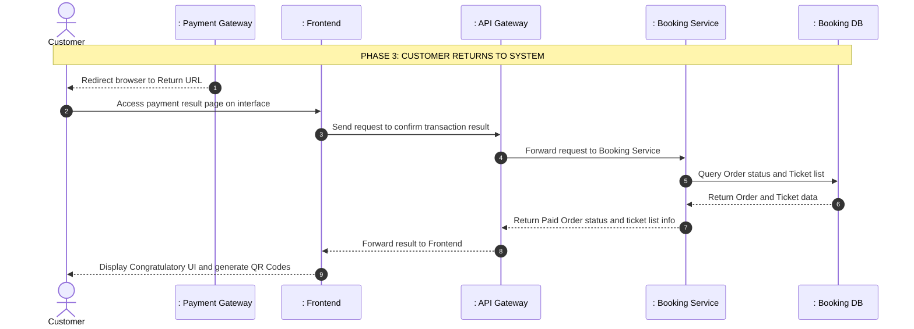

<b>Table 4.12: Payment & Ticket Issuance Flow - Phase 3: Customer Returns to System sequence diagram</b>

1. **Payment Request**: The customer selects a payment method and confirms. The system creates a transaction record with Pending Payment status in the database to store the transaction trace, then calls the Payment Gateway API to get the payment link URL and forwards it to the UI. The browser automatically redirects the customer to the third-party payment page.
2. **Background Webhook Processing (Security & Seat Claiming)**: This is the most crucial flow to determine the transaction result and handle contention business logic. When the IPN Webhook reports a successful payment, the system verifies the security signature. Then, it immediately makes an API call to the `Management Service` to **officially claim/deduct the ticket**. This determines the winner if multiple people pay for the same seat simultaneously.
3. **Status Update or Refund (Within IPN flow)**:
   - **If ticket claim is successful**: The system updates the transaction and order status to Paid, generates electronic tickets with secure QR codes, and publishes a success event to Kafka.
   - **If ticket claim fails (seat was taken by someone who paid 1 millisecond earlier)**: The system updates the order status to `Failed (Requires Refund)` and automatically calls the Payment Gateway's Refund API to return money to the losing customer's account.
4. **Customer Returns to System**: After completing the transaction, the customer is redirected back to the system interface via the return link. The interface calls an API to confirm the actual status of the order from the database and displays the corresponding e-tickets with QR codes (or displays an error if refunded).

---

#### 4.4.3.3 TTL Order Cancellation Flow

To prevent "virtual ticket holding" from affecting other customers' purchasing opportunities and wasting system resources, a Scheduler process will automatically clean up expired payment orders.

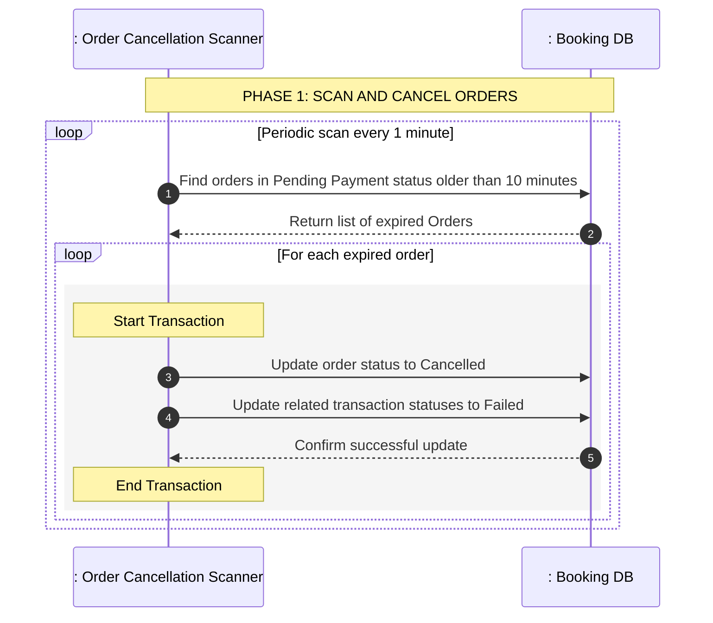

<b>Table 4.13: TTL Order Cancellation Flow sequence diagram</b>

1. **Periodic Scanning Process**: The background scanner runs periodically once a minute. It queries the database to find all orders still in Pending Payment status but created more than 10 minutes prior to the current time.
2. **Status Update**: For each expired order found, the system executes a local transaction to update the order status to Cancelled and related payment request statuses to Failed to close the payment transaction. There is no need to send an event to refund tickets because the system never deducted the user's ticket during the booking phase.

---

#### 4. Solving High Concurrency IPN & Refund for a Single Seat

In the "First-to-Pay-Wins" model, the **resource contention** problem is moved from the moment the Book button is clicked to the **Payment IPN Webhook processing** time. Dozens of people can simultaneously pay for 1 ticket in the same second, leading to the risk of Overbooking. 

The system solves this problem at the IPN flow with 3 layers of protection:

**Tier 1: Serialization via Event Queue Partitioning**
- When the IPN Webhook is called by the payment gateway, the Booking Service does not process it directly but pushes a "Payment Received" event into the Kafka queue with the Partition Key being the seat ID or event ID.
- IPNs for the same seat will be routed to the same partition and processed sequentially (first-in, first-out) by the Consumer. Whoever's IPN network signal arrives 1 millisecond earlier will be extracted and processed by the Consumer first.

**Tier 2: Application-level Distributed Lock using a database-backed lock mechanism**
- The Consumer processing the IPN will use a a central database lock registry to check if this seat has already been locked for someone.
- The first Consumer to acquire the lock will call the `Management Service` to claim the ticket. Consumers of slower payers will be immediately blocked at the JDBC Lock layer and automatically jump to the **Refund** flow without querying the DB.

**Tier 3: Pessimistic Lock at Database Layer**
- At the DB layer of the `Management Service`, when executing the official ticket claim action, the system uses a Pessimistic Write Lock.
- The first transaction will lock the data row of that seat/ticket tier. Subsequent transactions that bypass the JDBC Lock layer must also wait. Once the first transaction successfully locks the ticket, the lock is released, and subsequent transactions will see that the ticket is gone, get rejected, and also return to the Refund flow.

---

#### 5. Notable Architectural Design Solutions

*   **Non-blocking Response & Status Polling**:
  Helps the system withstand massive loads during ticket sales. The main thread receives booking requests and returns results instantly within milliseconds; all heavy DB write processing is pushed to the asynchronous processing queue.
*   **Anti-Oversell Booking Queue**:
  Uses a message queue mechanism to serialize ticket purchase requests strictly chronologically. The processor consumes requests one by one, completely preventing data contention and overselling beyond actual capacity without applying complex database locking mechanisms that cause system bottlenecks.
*   **Independent Webhook Payment Verification**:
  Completely eliminates security risks from the Client side. All activities regarding wallet updates, ticket code generation, and order completion rely on Webhooks communicating directly between servers authenticated with digital signature encryption algorithms.
*   **Anti-Duplicate Payment Mechanism**:
  Uses an idempotent transaction ID when initializing payment requests, preventing users from clicking the payment button multiple times and creating duplicate transactions on the third-party Payment Gateway.
*   **Automatic Resource Release**:
  Uses an automatic Time-To-Live cancellation model for orders via a periodic background scanner to help the system quickly release virtually held tickets, optimizing ticket access opportunities for all customers.

---

#### 6. Performance Optimization Solutions

Although the architecture ensures correctness and data integrity, removing database replication and using synchronous API calls risks creating a bottleneck at the `Management Service` under high traffic (e.g., popular music event sales).

To keep the system running smoothly under high load, the following optimization solutions can be implemented:

**7.1. Internal Communication via gRPC instead of REST API**
Instead of traditional HTTP/JSON REST APIs, the `Official Ticket Claim` call from the Booking Service to the Management Service should be implemented via **gRPC**.
- gRPC uses Protobuf (binary encoding) and HTTP/2, significantly reducing payload size and improving internal communication speed by up to 10x.
- Supports Multiplexing to avoid the overhead of establishing new TCP connections for each customer ticket purchase.

**7.2. Ticket Inventory Concurrency Control with Optimistic Locking**
Querying and locking the Management Service DB directly with pessimistic locks for every customer ticket claim can cause bottlenecks. Instead, implement **Optimistic Locking** at the database layer.
- A version tracking field is added to the ticket data model.
- When multiple requests simultaneously attempt to deduct the ticket balance, the data access layer includes the current version identifier in the update request. The first transaction successfully updates the balance and increments the version.
- Subsequent transactions will fail with a concurrent modification error. The Booking Service catches this exception and safely creates a Refund, completely avoiding Database Deadlocks and improving throughput.

**7.3. Saga Pattern (Choreography)**
To avoid depending on synchronous calls (even gRPC), an Event-driven Saga Pattern can be used:
1. Booking Service receives IPN Webhook, changes order status to `PAID_PROCESSING`, and emits a `PaymentReceivedEvent`.
2. Management Service listens to this event, attempts to deduct the ticket.
   - If tickets are available, it emits a `TicketReservedEvent`. Booking Service listens and changes Order status to `CONFIRMED`.
   - If sold out (taken by someone else), it emits a `TicketReservationFailedEvent`. Booking Service listens, changes Order to `FAILED_REFUNDING`, and calls the Refund API.

### 4.4.4 E-Ticket Check-in

#### 4.4.4.1 E-Ticket Check-in Flow

This flow describes the sequence of actions when staff uses a scanning device on the customer's QR code at the event gate to authenticate entry access.

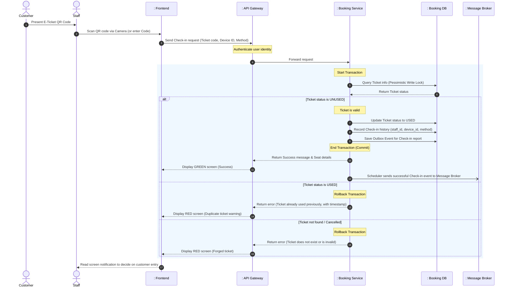

<b>Table 4.14: E-Ticket Check-in Flow sequence diagram</b>

1. **Scan & Receive**: The customer shows the QR code to the staff. The staff's app reads the data to get the `ticketCode`. It then sends an API request to the system with extra info (device ID, scanning method).
2. **Validation & Stop Double-Spending**: 
   - The `Booking Service` gets the request and looks for the ticket in the database.
   - To stop 2 staff members from scanning the same ticket at the exact same time (if the customer printed many copies), the system uses a **Pessimistic Write Lock** when it reads the ticket: `SELECT * FROM tickets WHERE ticket_code = ? FOR UPDATE`.
   - The system checks: If `status == UNUSED`, the ticket is good. If `status == USED` (or CANCELLED), it stops the process to prevent fake tickets.
3. **Update & History**:
   - The system changes the ticket status to `USED`.
   - It adds a new record to the `checkins` table with all details: Who scanned it (`staff_id`), with what device (`device_id`), at what time (`checked_in_at`), and how it was scanned (`method`). This is the most important proof if there are complaints later.
4. **Real-time Data Sync**:
   - Using the Transactional Outbox Pattern again, the system saves a check-in event together with the transaction. 
   - Then, a "1 customer just entered" message is sent to the Message Broker. Other services (like the Organizer's Dashboard) listen to this message and show it on the screen in real-time. This helps them see the number of people inside going up second by second, without needing to press F5 to reload the database.

---

#### 2. Notable Architectural Design Solutions

*   **Device Tracking**: 
  Saving the scanner's ID (`device_id`) helps Organizers see which gates are busy, which are empty, and find bad staff behavior.
*   **Dynamic Secure QR Codes (Optional)**:
  For big events, to stop people from taking photos of the QR ticket and sending it to friends, the QR code on the user's app can change every 30 seconds. In this case, the Check-in flow will have one more step to check if the code is still fresh before asking the database.
*   **Offline First Sync (Future Idea)**:
  If the event is in a place with bad internet, the scanning app can download the valid ticket list first. The app can scan tickets without the internet -> Update status offline -> A few minutes later when the network is back, it automatically sends the check-in data to the Server.
