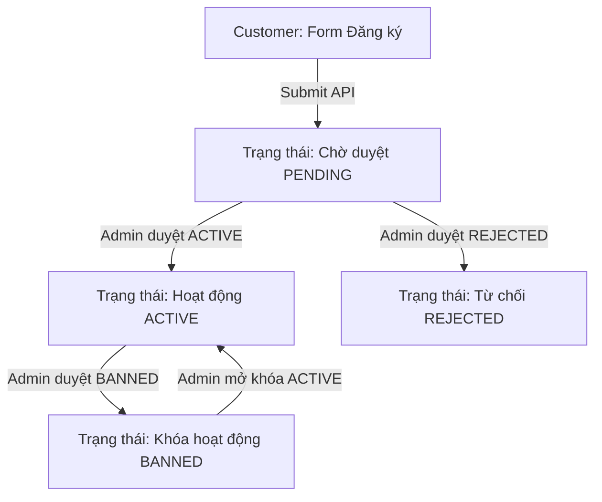
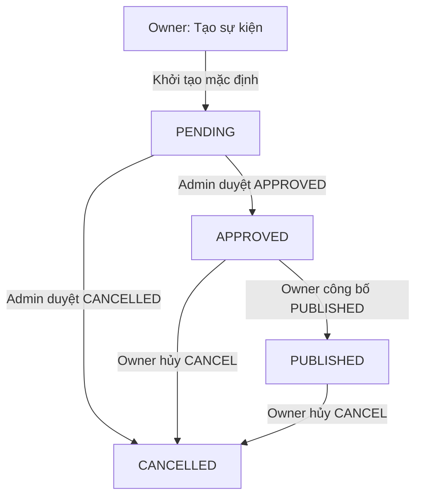

# TÀI LIỆU HƯỚNG DẪN TÍCH HỢP FRONTEND (FE INTEGRATION GUIDE)

**Nghiệp vụ**: Luồng Đăng ký và Phê duyệt Tổ chức (Organization Registration & Verification Flow).

Tài liệu này đặc tả chi tiết giao tiếp API, cấu trúc dữ liệu, các bước chuyển giao diện (UI state) và cách xử lý lỗi để đội ngũ phát triển Frontend (FE) tích hợp nhanh chóng và chính xác.

---

## 1. Bản Đồ Chuyển Trạng Thái Giao Diện (UI State Machine)

Trạng thái hồ sơ tổ chức được lưu trữ và trả về qua trường `status` dưới dạng Enum. FE cần bám sát các trạng thái này để hiển thị màn hình phù hợp:



- **PENDING**: Hiển thị màn hình "Đăng ký thành công, hồ sơ đang chờ kiểm duyệt từ hệ thống". Khóa form không cho sửa đổi.
- **ACTIVE**: Hiển thị bảng điều khiển (Dashboard) của Nhà tổ chức sự kiện. Tài khoản của khách hàng lúc này đã được nâng cấp quyền để tạo và quản lý sự kiện.
- **REJECTED**: Hiển thị thông báo bị từ chối phê duyệt kèm theo lý do từ chối. Cho phép hiển thị nút "Đăng ký lại" để cập nhật và gửi lại form mới.
- **BANNED**: Hiển thị màn hình khóa cảnh báo vi phạm điều khoản dịch vụ, không cho phép truy cập các chức năng quản trị sự kiện.

---

## 2. Đặc Tả Chi Tiết API (API Specifications)

### 2.1. API 1: Đăng ký Thông tin Tổ chức
Dành cho người dùng (vai trò ban đầu: `CUSTOMER`) gửi hồ sơ đăng ký.

- **Đường dẫn**: `POST /api/organizations`
- **Headers**:
  - `Authorization: Bearer <jwt_token>` (Bắt buộc)
- **Cấu trúc Body (JSON)**:
  ```json
  {
    "name": "Tên tổ chức đăng ký (Bắt buộc)",
    "abbreviationName": "Tên viết tắt",
    "taxCode": "Mã số thuế (Bắt buộc)",
    "representativeName": "Tên người đại diện pháp luật",
    "representativePosition": "Chức vụ người đại diện",
    "hotline": "Số điện thoại đường dây nóng",
    "officialEmail": "Email liên hệ chính thức",
    "provinceCity": "Tỉnh / Thành phố",
    "district": "Quận / Huyện",
    "wardCommune": "Phường / Xã",
    "headquarterAddress": "Địa chỉ trụ sở chính",
    "websiteUrl": "Đường dẫn Website",
    "fanpageUrl": "Đường dẫn mạng xã hội / Fanpage",
    "description": "Mô tả chi tiết về tổ chức"
  }
  ```

- **Phản hồI thành công (201 Created)**:
  ```json
  {
    "id": 1,
    "name": "Tên tổ chức đăng ký",
    "abbreviationName": "Tên viết tắt",
    "taxCode": "0123456789",
    "status": "PENDING",
    "officialEmail": "email@local",
    "syncedAt": "2026-06-24T16:00:00Z"
  }
  ```

---

### 2.2. API 2: Phê duyệt / Từ chối Hồ sơ (Chỉ dành cho Admin)
Dành cho Quản trị viên hệ thống để thực hiện thay đổi trạng thái hồ sơ.

- **Đường dẫn**: `POST /api/organizations/{id}/verify`
- **Headers**:
  - `Authorization: Bearer <jwt_token>` (Bắt buộc, tài khoản phải có quyền `ADMIN`)
- **Cấu trúc Body (JSON)**:
  ```json
  {
    "decision": "ACTIVE", 
    "reason": "Lý do phê duyệt hoặc từ chối (Bắt buộc nhập nếu từ chối hoặc khóa)"
  }
  ```
  > **Lưu ý về Enum `decision`**: Chỉ chấp nhận các giá trị: `ACTIVE`, `REJECTED`, `BANNED`.

- **Phản hồI thành công (200 OK)**:
  ```json
  {
    "id": 1,
    "name": "Tên tổ chức",
    "status": "ACTIVE",
    "verifiedAt": "2026-06-24T16:05:00Z"
  }
  ```

---

## 3. Quy Tắc Xử Lý Lỗi Tập Trung (FE Error Handling)

Hệ thống đã chuẩn hóa toàn bộ cấu trúc lỗi trả về. FE cần thiết lập Interceptor/Catch block để xử lý theo các mã HTTP Status sau:

### 3.1. Lỗi Dữ liệu Không Hợp Lệ (400 Bad Request)
Xảy ra khi các ràng buộc dữ liệu phía Client gửi lên bị sai (ví dụ: thiếu trường bắt buộc, hoặc logic nghiệp vụ bị sai như duyệt sai bước trạng thái).

- **Cấu trúc JSON phản hồI lỗi thường gặp**:
  ```json
  {
    "error": "Thông điệp mô tả lỗi chi tiết bằng tiếng Anh đơn giản"
  }
  ```
- **Ví dụ**:
  - Khi trùng mã số thuế: `{"error": "Tax code is already in use."}`
  - Khi duyệt hồ sơ mà tổ chức chưa có chủ tài khoản: `{"error": "OWNER not found for this organization. Cannot activate."}`

- **Trường hợp lỗi Validate định dạng Form**:
  Nếu nhiều trường bị lỗi định dạng, API sẽ trả về danh sách trường lỗi tương ứng:
  ```json
  {
    "name": "name is required"
  }
  ```
  *(FE cần ánh xạ các khóa này lên thông báo lỗi dưới các ô Input của Form tương ứng)*.

### 3.2. Lỗi Xung Đột Dữ Liệu (409 Conflict)
Xảy ra khi có các xung đột dữ liệu ngầm định trong cơ sở dữ liệu.
- **Mã lỗi**: `409 Conflict`
- **Cấu trúc JSON**:
  ```json
  {
    "error": "Database conflict: duplicate entry."
  }
  ```
- **Hướng xử lý của FE**: Hiển thị thông báo Toast cảnh báo dữ liệu bị trùng lặp hoặc xung đột với thao tác của phiên làm việc khác.

### 3.3. Lỗi Hết Hạn / Sai Token (401 Unauthorized)
Xảy ra khi Token JWT bị thiếu, hết hạn hoặc không hợp lệ.
- **Hướng xử lý của FE**: Thực hiện xóa Token hiện tại ở local storage và chuyển hướng người dùng về trang đăng nhập `/login`.

### 3.4. Lỗi Sai Quyền Hạn (403 Forbidden)
Xảy ra khi người dùng cố tình gọi các API không được phép (ví dụ: Tài khoản `CUSTOMER` cố gọi API duyệt hồ sơ của Admin).
- **Hướng xử lý của FE**: Hiển thị màn hình chặn quyền hoặc thông báo cảnh báo bảo mật.

---

## 4. Lưu Ý Quan Trọng Cho Luồng Trải Nghiệm Người Dùng (UX Notes)

> [!IMPORTANT]
> **Hiện tượng Đồng bộ Quyền Bất đồng bộ**:
> Do việc nâng cấp tài khoản từ `CUSTOMER` lên `ORGANIZER` được xử lý bất đồng bộ qua hệ thống Kafka phía sau để đảm bảo tính sẵn sàng, nên khi Admin click "Phê duyệt" và nhận lại `200 OK`:
> 1. Trạng thái của Tổ chức đã chuyển sang `ACTIVE` ngay lập tức.
> 2. Tuy nhiên, quyền hạn của người dùng (trong token cũ của trình duyệt) **chưa tự động thay đổi ngay**.
> 
> **Giải pháp đề xuất cho FE**:
> - Sau khi gửi yêu cầu phê duyệt thành công, hiển thị thông báo: *"Duyệt thành công. Hệ thống đang tiến hành nâng cấp quyền hạn của tài khoản. Quá trình có thể mất vài giây."*
> - Yêu cầu người dùng đăng nhập lại hoặc tự động gọi API làm mới Token (Refresh Token API) sau khi hiển thị trạng thái hồ sơ là `ACTIVE` để cập nhật quyền hạn `ORGANIZER` mới nhất cho Client.

---

## 5. Luồng Vòng Đời & Cấu Hình Sự Kiện (Event Lifecycle & Configuration Flow)

Quy trình quản lý sự kiện cho phép các tổ chức sở hữu (`OWNER`) cấu hình chi tiết hạng vé, sơ đồ chỗ ngồi và gửi duyệt đến Admin.

### 5.1. Bản Đồ Chuyển Trạng Thái Sự Kiện
Trạng thái vòng đời sự kiện (`status` enum) chuyển dịch theo sơ đồ sau:



- **PENDING**: Trạng thái mặc định ngay khi tạo xong. Chờ Admin phê duyệt.
- **APPROVED**: Admin đã phê duyệt. Cho phép hiển thị nút "Công bố sự kiện" (`publish`) cho Owner.
- **PUBLISHED**: Sự kiện được công bố ra công chúng và đồng bộ dữ liệu sang `booking-service`. Không cho phép chỉnh sửa cấu hình vé/ghế nữa.
- **CANCELLED**: Sự kiện đã bị hủy hoặc bị Admin từ chối duyệt.

---

### 5.2. Đặc Tả Chi Tiết API Sự Kiện

#### 5.2.1. API Tạo Sự Kiện (Bao gồm Vé và Ghế ngồi)
Nhà tổ chức (phải có vai trò `OWNER` trong tổ chức đang `ACTIVE`) gửi yêu cầu tạo sự kiện kèm theo cấu hình hạng vé và sơ đồ phân bổ ghế ngồi.

- **Đường dẫn**: `POST /api/events/create`
- **Headers**:
  - `Authorization: Bearer <jwt_token>` (Bắt buộc)
- **Cấu trúc Body (JSON)**:
  ```json
  {
    "organizationId": 1,
    "title": "Đại nhạc hội Music Festival 2026",
    "description": "Sự kiện âm nhạc hoành tráng nhất năm",
    "venue": "Sân vận động Quốc gia Mỹ Đình",
    "city": "Hà Nội",
    "locationCoords": "21.0202, 105.7739",
    "startTime": "2026-07-25T19:00:00Z",
    "endTime": "2026-07-25T23:00:00Z",
    "bannerUrl": "https://example.com/images/banner.jpg",
    "ticketTiers": [
      {
        "name": "VIP Class",
        "tierType": "VIP",
        "price": 2500000.00,
        "quantityTotal": 100,
        "colorCode": "#FF0000",
        "saleStart": "2026-06-26T08:00:00Z",
        "saleEnd": "2026-07-24T18:00:00Z"
      },
      {
        "name": "Standard Zone",
        "tierType": "SEATED",
        "price": 600000.00,
        "quantityTotal": 500,
        "colorCode": "#00FF00",
        "saleStart": "2026-06-26T08:00:00Z",
        "saleEnd": "2026-07-24T18:00:00Z"
      }
    ],
    "seatMaps": [
      {
        "name": "Sơ đồ Khu khán đài A",
        "totalRows": 10,
        "totalCols": 10,
        "layoutJson": "{\"sectors\": [{\"id\": \"A\", \"name\": \"Khán đài A\"}]}",
        "seats": [
          {
            "seatCode": "A-01",
            "rowLabel": "A",
            "colNumber": 1,
            "ticketTierName": "VIP Class"
          },
          {
            "seatCode": "B-01",
            "rowLabel": "B",
            "colNumber": 1,
            "ticketTierName": "Standard Zone"
          }
        ]
      }
    ]
  }
  ```
  > [!TIP]
  > **Quy tắc ánh xạ (Mapping)**: 
  > - FE cần đảm bảo `ticketTierName` của từng ghế trong danh sách `seats` của sơ đồ ghế phải trùng khớp hoàn toàn với trường `name` của một trong các hạng vé gửi lên trong danh sách `ticketTiers`. Nếu gửi tên hạng vé không tồn tại, API sẽ trả về lỗi `400 Bad Request`.

- **Phản hồi thành công (201 Created)**:
  ```json
  {
    "id": 12,
    "status": "PENDING",
    "createdAt": "2026-06-25T00:30:00Z",
    "updatedAt": "2026-06-25T00:30:00Z"
  }
  ```

---

#### 5.2.2. API Công Bố Sự Kiện (Chỉ dành cho OWNER của tổ chức)
Khi sự kiện đã ở trạng thái `APPROVED` sau khi qua kiểm duyệt, OWNER có thể gọi API này để chính thức công bố sự kiện ra công chúng.

- **Đường dẫn**: `POST /api/events/{eventId}/publish`
- **Headers**:
  - `Authorization: Bearer <jwt_token>` (Bắt buộc)
- **Phản hồi thành công (200 OK)**:
  ```json
  {
    "message": "Event published successfully"
  }
  ```

---

#### 5.2.3. API Hủy Sự Kiện (Chỉ dành cho OWNER của tổ chức)
OWNER có thể chủ động hủy sự kiện của mình ở bất kỳ giai đoạn nào.

- **Đường dẫn**: `POST /api/events/{eventId}/cancel`
- **Headers**:
  - `Authorization: Bearer <jwt_token>` (Bắt buộc)
- **Phản hồi thành công (200 OK)**:
  ```json
  {
    "message": "Event cancelled successfully"
  }
  ```

---

#### 5.2.4. API Phê Duyệt / Hủy Sự Kiện (Chỉ dành cho ADMIN)
Quyết định phê duyệt sự kiện và đưa sự kiện sang trạng thái `APPROVED` hoặc `CANCELLED`.

- **Đường dẫn**: `POST /api/events/{eventId}/approve`
- **Headers**:
  - `Authorization: Bearer <jwt_token>` (Bắt buộc, tài khoản ADMIN)
- **Cấu trúc Body (JSON)**:
  ```json
  {
    "decision": "APPROVED",
    "reason": "Thông tin sự kiện đầy đủ, hợp lệ"
  }
  ```
  > **Enum `decision`**: Chỉ nhận một trong hai giá trị: `APPROVED` hoặc `CANCELLED`.

- **Phản hồi thành công (200 OK)**:
  ```json
  {
    "id": 1,
    "eventId": 12,
    "organizerId": 2,
    "organizerRole": "OWNER",
    "adminUserId": 99,
    "decision": "APPROVED",
    "eventStatus": "APPROVED",
    "reason": "Thông tin sự kiện đầy đủ, hợp lệ",
    "decidedAt": "2026-06-25T00:35:00Z"
  }
  ```

---

### 5.3. Ràng Buộc Validation Quan Trọng Phía FE Cần Lưu Ý
Để tránh việc API trả về lỗi `400 Bad Request`, FE cần tự động validate form trước khi gửi lên:
1. **Địa điểm (`venue`, `city`)**: Không được để trống.
2. **Thời gian bắt đầu (`startTime`)**: Phải nằm ở tương lai (sau thời gian hiện tại của client).
3. **Thời gian kết thúc (`endTime`)**: Phải sau thời gian bắt đầu (`startTime`).
4. **Phân quyền**:
   - Ẩn hoặc chặn nút "Tạo sự kiện" đối với các tài khoản có vai trò `STAFF` hoặc người dùng chưa có tổ chức `ACTIVE`.
   - Nút "Công bố" (`publish`) chỉ được kích hoạt hiển thị khi sự kiện có trạng thái `APPROVED` và người dùng hiện tại là `OWNER` của tổ chức tạo sự kiện.

