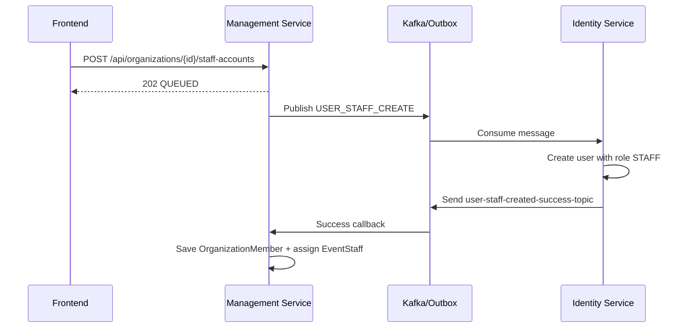

# STAFF ACCOUNT FLOW - FE INTEGRATION GUIDE

**Nghiệp vụ**: Tổ chức tạo tài khoản Staff và hệ thống tự động gán Staff vào toàn bộ sự kiện của tổ chức.

Tài liệu này dành riêng cho Frontend khi cần xây màn hình quản lý Staff trong dashboard của Organizer. Luồng hiện tại chạy theo mô hình bất đồng bộ: FE gửi yêu cầu tạo Staff, backend trả về trạng thái `QUEUED`, sau đó hệ thống dùng Kafka + Outbox để tạo account ở `identity-service`, rồi callback ngược về `management-service` để gắn Staff vào tổ chức và các sự kiện liên quan.

---

## 1. Mục Tiêu Nghiệp Vụ

Khi Organizer tạo Staff mới, hệ thống phải:

1. Tạo tài khoản người dùng mới trong `identity-service`.
2. Gán user đó đúng một role duy nhất là `STAFF`.
3. Tạo quan hệ thành viên tổ chức bằng `OrganizationMember` với `memberRole = STAFF`.
4. Tự động assign Staff vào tất cả sự kiện hiện có của tổ chức bằng `EventStaff`.
5. Cho phép Staff đăng nhập và sử dụng các chức năng:
   - check-in QR
   - xem lịch sử check-in của sự kiện

---

## 2. Luồng Trạng Thái Cho FE

FE nên coi đây là một quy trình 3 pha:

```mermaid
graph TD
    A[Organizer nhập form tạo Staff] --> B[POST /api/organizations/{id}/staff-accounts]
    B --> C[API trả 202 QUEUED]
    C --> D[Backend publish Kafka / tạo account / callback]
    D --> E[Staff xuất hiện trong danh sách Staff của event]
```

### 2.1. Trạng thái hiển thị trên FE

- **Draft**: đang nhập form.
- **Queued**: đã bấm tạo, backend đã nhận request nhưng chưa hoàn tất xử lý.
- **Completed**: Staff đã được tạo thành công và được assign vào các event.
- **Failed**: backend trả lỗi đồng bộ, hoặc callback bất đồng bộ báo lỗi.

### 2.2. Gợi ý UX

- Sau khi submit thành công, giữ nguyên form ở trạng thái loading và hiển thị thông báo kiểu: "Đang tạo tài khoản Staff, vui lòng chờ vài giây".
- Sau đó tự động refresh danh sách Staff của event hoặc màn hình quản lý event.
- Nếu sau một khoảng thời gian ngắn chưa thấy Staff mới, vẫn nên cho phép người dùng bấm refresh thủ công.

---

## 3. API Dùng Cho FE

### 3.1. Tạo tài khoản Staff cho tổ chức

- **Đường dẫn**: `POST /api/organizations/{id}/staff-accounts`
- **Mục đích**: Organizer tạo staff account mới cho tổ chức.
- **Quyền**: chỉ `ORGANIZER` là owner của organization ACTIVE.

#### Headers

- `Authorization: Bearer <jwt_token>`
- `Content-Type: application/json`

> FE không cần tự set `X-User-Id`. Gateway/backend hiện tại sẽ truyền user context.

#### Request body

```json
{
  "email": "staff01@tickethub.vn",
  "password": "P@ssw0rd123",
  "fullName": "Nguyen Van A",
  "phone": "0909000000"
}
```

#### Response thành công

Backend hiện trả `202 Accepted` với payload:

```json
{
  "requestId": "550e8400-e29b-41d4-a716-446655440000",
  "requestStatus": "QUEUED",
  "organizationId": 1,
  "organizationName": "ABC Event",
  "userId": null,
  "email": "staff01@tickethub.vn",
  "fullName": "Nguyen Van A",
  "role": "STAFF",
  "organizationRole": "STAFF",
  "assignedAt": null,
  "createdAt": null,
  "updatedAt": null
}
```

#### Ý nghĩa các field

- `requestId`: mã outbox của request, dùng để debug/log UI nếu cần.
- `requestStatus`: hiện tại luôn là `QUEUED` khi vừa submit.
- `userId`, `assignedAt`, `createdAt`, `updatedAt`: có thể chưa có ngay vì xử lý bất đồng bộ.

---

### 3.2. Danh sách Staff của một sự kiện

FE có thể dùng để kiểm tra Staff đã được assign sau khi backend callback hoàn tất.

- **Đường dẫn**: `GET /api/events/{eventId}/staff`
- **Mục đích**: hiển thị danh sách Staff đang được gán vào event.

#### Response mẫu

```json
[
  {
    "id": 12,
    "staffId": 45,
    "email": "staff01@tickethub.vn",
    "fullName": "Nguyen Van A",
    "roleInEvent": "CHECKIN_STAFF",
    "assignedAt": "2026-07-14T10:00:00Z"
  }
]
```

#### Gợi ý FE

- Sau khi nhận `202 QUEUED` từ API tạo Staff, FE nên refresh danh sách staff của một hoặc nhiều event liên quan.
- Vì hệ thống tự assign staff vào tất cả event của organization, nếu màn hình FE đang là trang chi tiết event thì chỉ cần reload danh sách staff của event đó.

> Hiện tại backend chưa có API riêng để liệt kê toàn bộ staff theo organization. Nếu FE cần màn hình "Staff của tổ chức", nên dùng danh sách event staff hiện có hoặc chờ backend bổ sung endpoint riêng.

---

## 4. Xử Lý Lỗi Phía FE

### 4.1. `400 Bad Request`

Thường gặp khi:
- thiếu `email`, `password`, `fullName`
- password quá ngắn
- tổ chức chưa ở trạng thái `ACTIVE`
- user được chọn không phải role `STAFF`

FE nên hiển thị lỗi theo field hoặc toast thông báo tùy loại lỗi.

### 4.2. `403 Forbidden`

Xảy ra khi:
- người gọi không phải owner của organization
- staff không thuộc organization đó khi thao tác thủ công lên event

FE nên chặn từ UI ngay từ đầu bằng kiểm tra role/quyền.

### 4.3. `404 Not Found`

Xảy ra khi:
- organization không tồn tại
- event không tồn tại
- email không tìm thấy trong identity-service (nếu dùng chức năng assign tay theo email)

### 4.4. `409 Conflict`

Xảy ra khi:
- email đã tồn tại
- staff đã được tạo / liên kết trước đó

FE nên hiển thị thông báo rõ ràng để người dùng không nhập lại trùng.

### 4.5. `202 Accepted`

Đây là trạng thái thành công cho luồng bất đồng bộ.

FE phải hiểu rằng:
- request đã được nhận
- dữ liệu thật có thể chưa xuất hiện ngay
- cần polling/refresh để thấy kết quả cuối

---

## 5. Luồng Dữ Liệu Nội Bộ

FE không cần gọi trực tiếp Kafka, nhưng cần hiểu logic để thiết kế màn hình đúng:



---

## 6. Checklist Khi FE Làm Màn Hình Tạo Staff

- Form gồm `email`, `password`, `fullName`, `phone`.
- Nút submit chỉ bật khi form hợp lệ.
- Sau submit thành công, hiển thị trạng thái `QUEUED`.
- Tự động refresh danh sách staff sau vài giây.
- Nếu màn hình là trang event detail, refresh luôn danh sách staff của event.
- Không cho phép gửi nếu user hiện tại không phải owner của tổ chức.
- Hiển thị rõ lỗi trùng email hoặc quyền hạn không hợp lệ.

---

## 7. Ghi Chú Quan Trọng

- Staff account chỉ có role `STAFF`, không còn gắn thêm role khác trong luồng này.
- Khi staff được tạo thành công, backend tự động assign staff vào toàn bộ event của organization.
- FE không cần gọi API assign event thủ công cho staff mới, trừ khi muốn hỗ trợ thao tác bổ sung về sau.
- Luồng này phụ thuộc vào Kafka/outbox nên kết quả cuối cùng là bất đồng bộ.
